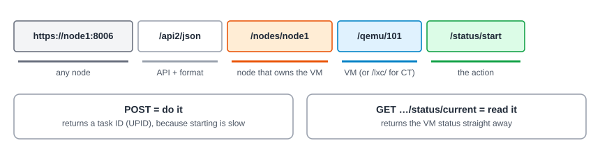

:::note[In a nutshell]
the Proxmox API is plain HTTPS + JSON on port 8006. A custom app authenticates with an **API token**, reads with `GET` and acts with `POST`/`PUT`/`DELETE`. Slow actions return a **task ID** rather than the result.
:::

## The shape of the API



- **Base URL:** `https://<node>:8006/api2/json`. Any node works, and Proxmox forwards the request to the right one.
- **Paths follow the resource tree:** cluster → nodes → VMs, e.g. `/nodes/pve1/qemu/101/status/start`.
- **Methods:** `GET` reads, `POST` creates or acts, `PUT` changes settings, `DELETE` removes.
- **Responses** wrap the result in `{"data": …}`.
- **Parameters** are sent as form fields (or JSON). Booleans are `0` / `1`.

## Authentication

|  | API token (for custom apps) | Ticket (for interactive scripts) |
|---|---|---|
| **Get it** | Created once in the web UI (see [2.1 Access & Tools](../access-tools/)) | `POST /access/ticket` with username and password |
| **Send it** | Header `Authorization: PVEAPIToken=<user>@<realm>!<tokenid>=<secret>` | Cookie `PVEAuthCookie=<ticket>`, plus header `CSRFPreventionToken` on every `POST`/`PUT`/`DELETE` |
| **Lifetime** | Until it expires or is revoked | 2 hours |
| **Rights** | Only what the token is granted (with privilege separation) | Everything the user can do |

### With an API token

```bash
PVE=https://pve1.example.com:8006/api2/json
AUTH='Authorization: PVEAPIToken=appuser@pve!provisioner=aaaaaaaa-bbbb-cccc-dddd-eeeeeeeeeeee'

curl -s -H "$AUTH" "$PVE/version"
```

```json
{"data":{"release":"9.2","repoid":"…","version":"9.2.x"}}
```

### With a ticket

```bash
# 1. Log in: returns a ticket and a CSRF token
curl -s "$PVE/access/ticket" --data-urlencode 'username=jane@pve' --data-urlencode 'password=…'

# 2. Reads only need the cookie
curl -s -b "PVEAuthCookie=$TICKET" "$PVE/nodes"

# 3. Writes also need the CSRF header
curl -s -b "PVEAuthCookie=$TICKET" -H "CSRFPreventionToken: $CSRF" -X POST "$PVE/nodes/pve1/qemu/101/status/start"
```

Tickets expire after 2 hours. Renew one by calling `POST /access/ticket` again with the current ticket as the password.

## Certificates

Nodes use a self-signed certificate unless someone has set up trusted ones (see [3.13 Certificates](../../user-guide/certificates/)). Your client must trust it:

- **Best:** point the client at the cluster's CA file, `/etc/pve/pve-root-ca.pem` (e.g. `curl --cacert pve-root-ca.pem`, or `verify_ssl` / `REQUESTS_CA_BUNDLE` in Python).
- **Lab only:** skip verification (`curl -k`). Never do this in production.

## Permissions in one minute

A token can only do what it has been granted: **privilege + path**. If it's missing something, the API answers:

```text
403 Forbidden: Permission check failed (/vms/101, VM.PowerMgmt)
```

That message names the path and the missing privilege. Grant it (see [3.8 Users, Roles & Permissions](../../user-guide/users-roles-permissions/)). The full list is in [4.3 Permission Matrix](../../reference/permission-matrix/).

## Responses and errors

| You get | It means |
|---|---|
| `200` with `data` = an object or list | A read succeeded |
| `200` with `data` = `"UPID:…"` | A slow action **started**. Follow the task to learn the result (see [2.5 Your First API Calls](../first-api-calls/)). |
| `400` + an `errors` object | A parameter is missing or invalid. Each one is named. |
| `401` | Wrong or expired credentials, or a typo in the token header |
| `403` | Missing privilege (see above) |
| `500` | The action failed. The message usually says why (locked VM, no quorum…). |
| `595` / `596` | The node you called couldn't reach the node that owns the resource |

## Tools that help

| Tool | Use it for |
|---|---|
| [API viewer](https://pve.proxmox.com/pve-docs/api-viewer/) | Every endpoint, parameter and required permission |
| `pvesh` (on a node) | The same API from the shell: `pvesh get /nodes` |
| Browser developer tools | Do something in the web UI and watch the API call it makes (Network tab). It's the quickest way to find the right endpoint. |
| [proxmoxer](https://pypi.org/project/proxmoxer/) | Python client library |
| Terraform / Ansible (community) | Infrastructure as code and automation |

**Next:** [2.5 Your First API Calls](../first-api-calls/) walks through a complete VM lifecycle.
