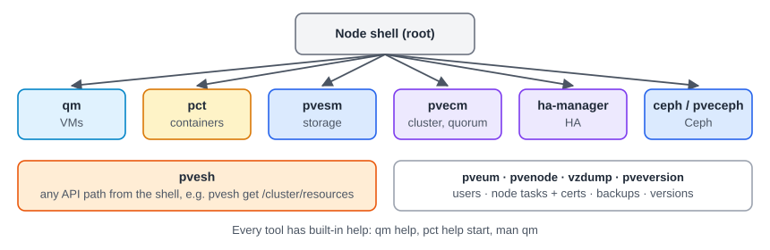

:::note[In a nutshell]
each part of Proxmox has its own command-line tool. Learn the six in the picture and you can do almost anything from a shell.
:::

## Finding things

| Question | Command |
|---|---|
| Which node is this, and what version? | `hostname; pveversion` |
| Which nodes are in the cluster? | `pvecm nodes` |
| Where is VM 101 running? | `pvesh get /cluster/resources --type vm \| grep 101` |
| Which VMs are on *this* node? | `qm list` (containers: `pct list`) |
| What are VM 101's settings? | `qm config 101` |
| How full is the storage? | `pvesm status` |
| What failed recently on this node? | `pvenode task list --errors 1` |

## Rules for the shell

- `qm` and `pct` only act on VMs **on the node you're logged in to**. SSH to the right node first.
- `pvesh` works cluster-wide. It calls the same API as the web UI.
- Use `apt dist-upgrade`, never `apt upgrade`, and don't install random packages on nodes.
- Prefer the tools above to editing files in `/etc/pve` by hand.
