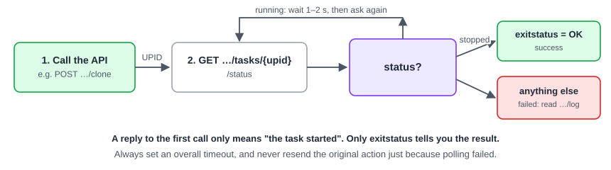

:::note[In a nutshell]
a copy-paste walkthrough that checks the connection, clones a VM from a template, configures it with cloud-init, starts it, waits for it and cleans up. Every step shows **curl** and **Python** ([proxmoxer](https://pypi.org/project/proxmoxer/)).
:::



## Before you start

- **A test cluster.** Don't learn on production.
- **An API token** (see [2.1 Access & Tools](../access-tools/)) with, at least: `VM.Clone` + `VM.Audit` on the template, and `VM.Allocate`, `VM.Config.*`, `VM.PowerMgmt` on the new VM's path. Plus `Datastore.AllocateSpace` on the storage and `SDN.Use` on the network. On PVE 9, reading IP addresses also needs `VM.GuestAgent.Audit`.
- **A cloud-init template**, e.g. VMID `9000` (see [3.3 Templates & Cloud-Init](../../user-guide/templates-cloud-init/)).
- **Tools:** `curl` and `jq` for the shell examples, or `pip install proxmoxer requests` for Python.

The examples use node `pve1` and template `9000`. Set these once:

```bash
PVE=https://pve1.example.com:8006/api2/json
AUTH='Authorization: PVEAPIToken=appuser@pve!provisioner=aaaaaaaa-bbbb-cccc-dddd-eeeeeeeeeeee'
NODE=pve1
```

```python
from proxmoxer import ProxmoxAPI

pve = ProxmoxAPI("pve1.example.com", user="appuser@pve", token_name="provisioner",
                 token_value="aaaaaaaa-bbbb-cccc-dddd-eeeeeeeeeeee", verify_ssl="pve-root-ca.pem")
node = "pve1"
```

## Step 1: Check the connection

```bash
curl -s -H "$AUTH" "$PVE/version"
curl -s -H "$AUTH" "$PVE/nodes"
```

```python
print(pve.version.get())
print([n["node"] for n in pve.nodes.get()])
```

- **Certificate error?** Your client doesn't trust the node's certificate (see [2.4 API Basics](../api-basics/)).
- **401?** Check the token header: `user@realm!tokenid=secret`.

## Step 2: Pick a VMID

```bash
VMID=$(curl -s -H "$AUTH" "$PVE/cluster/nextid" | jq -r .data)
```

```python
vmid = int(pve.cluster.nextid.get())
```

`nextid` only **suggests** a free ID. It doesn't reserve it, so two requests at the same moment can get the same number. If the clone in step 3 fails with *already exists*, ask for a new ID and try again (see [4.7 Errors & Gotchas](../../reference/errors-gotchas/)).

## Step 3: Clone the template

```bash
UPID=$(curl -s -H "$AUTH" -X POST "$PVE/nodes/$NODE/qemu/9000/clone" \
  -d newid=$VMID -d name=web01 | jq -r .data)
```

```python
upid = pve.nodes(node).qemu(9000).clone.post(newid=vmid, name="web01")
```

- Cloning a **template** makes a **linked clone** by default: fast and small. Add `full=1` for an independent copy.
- Other useful options: `target` (another node, if the storage is shared), `storage` (for full clones) and `pool`.

## Step 4: Wait for the task

The clone runs in the background. Ask about the task until it stops, then check `exitstatus`:

```bash
wait_task() {   # usage: wait_task <UPID>
  local node; node=$(cut -d: -f2 <<<"$1")
  while :; do
    st=$(curl -s -H "$AUTH" "$PVE/nodes/$node/tasks/$1/status")
    [ "$(jq -r .data.status <<<"$st")" = stopped ] && break
    sleep 2
  done
  jq -r .data.exitstatus <<<"$st"          # "OK" means success
}
wait_task "$UPID"
```

```python
import time

def wait_task(upid, timeout=600):
    task_node = upid.split(":")[1]                       # the node is part of the UPID
    deadline = time.monotonic() + timeout
    while time.monotonic() < deadline:
        st = pve.nodes(task_node).tasks(upid).status.get()
        if st["status"] == "stopped":
            if st.get("exitstatus") != "OK" and not st.get("exitstatus", "").startswith("WARNINGS"):
                log = pve.nodes(task_node).tasks(upid).log.get(limit=50)
                raise RuntimeError(st.get("exitstatus") + "\n" + "\n".join(l["t"] for l in log))
            return st
        time.sleep(2)
    raise TimeoutError(f"{upid} still running")         # not necessarily failed: check again later

wait_task(upid)
```

More on tasks: [4.2 Async Tasks & UPIDs](../../reference/tasks-upids/).

## Step 5: Configure it

Set the size and cloud-init details. `PUT …/config` applies the change straight away and returns nothing:

```bash
KEY=$(python3 -c 'import urllib.parse; print(urllib.parse.quote(open("id_ed25519.pub").read().strip(), safe=""))')
curl -s -H "$AUTH" -X PUT "$PVE/nodes/$NODE/qemu/$VMID/config" \
  -d cores=2 -d memory=4096 -d ciuser=ubuntu \
  --data-urlencode "sshkeys=$KEY" \
  --data-urlencode "ipconfig0=ip=10.0.10.21/24,gw=10.0.10.1"
```

```python
from urllib.parse import quote

key = open("id_ed25519.pub").read().strip()
pve.nodes(node).qemu(vmid).config.put(
    cores=2, memory=4096, ciuser="ubuntu",
    sshkeys=quote(key, safe=""),                        # must be URL-encoded
    ipconfig0="ip=10.0.10.21/24,gw=10.0.10.1",          # or "ip=dhcp"
)
```

:::caution
`sshkeys` must be **URL-encoded** inside the value. The curl example encodes it twice on purpose: once for the key, once for the form. This is the most common cloud-init mistake.
:::

## Step 6: Start it and check

```bash
UPID=$(curl -s -H "$AUTH" -X POST "$PVE/nodes/$NODE/qemu/$VMID/status/start" | jq -r .data)
wait_task "$UPID"
curl -s -H "$AUTH" "$PVE/nodes/$NODE/qemu/$VMID/status/current" | jq -r .data.status    # running
curl -s -H "$AUTH" "$PVE/nodes/$NODE/qemu/$VMID/agent/network-get-interfaces"
```

```python
wait_task(pve.nodes(node).qemu(vmid).status.start.post())
print(pve.nodes(node).qemu(vmid).status.current.get()["status"])      # "running"

# IP addresses from the guest agent (it needs a moment after boot)
for nic in pve.nodes(node).qemu(vmid).agent("network-get-interfaces").get()["result"]:
    print(nic["name"], [a["ip-address"] for a in nic.get("ip-addresses", [])])
```

The guest agent must be installed in the template and enabled on the VM. Otherwise the last call fails.

## Step 7: Clean up

```bash
wait_task "$(curl -s -H "$AUTH" -X POST "$PVE/nodes/$NODE/qemu/$VMID/status/stop" | jq -r .data)"
wait_task "$(curl -s -H "$AUTH" -X DELETE "$PVE/nodes/$NODE/qemu/$VMID?purge=1&destroy-unreferenced-disks=1" | jq -r .data)"
```

```python
wait_task(pve.nodes(node).qemu(vmid).status.stop.post())
wait_task(pve.nodes(node).qemu(vmid).delete(purge=1, **{"destroy-unreferenced-disks": 1}))
```

`purge=1` also removes the VM from backup jobs and HA.

## What usually goes wrong

| Symptom | Cause | Fix |
|---|---|---|
| Certificate verification error | The client doesn't trust the node's certificate | Use the cluster CA file (see [2.4 API Basics](../api-basics/)) |
| `401` | Wrong token format or secret | `PVEAPIToken=user@realm!tokenid=secret` |
| `403 Permission check failed (…)` | The token lacks that privilege on that path | Grant it (see [4.3 Permission Matrix](../../reference/permission-matrix/)) |
| `VM … already exists` | Another request took the same VMID | Get a new ID and retry |
| `VM is locked (clone)` | You didn't wait for the clone task | Always wait for the task before the next step |
| Task ends with an error | The action failed after it started | Read the task log: `…/tasks/{upid}/log` |
| No IP addresses | No guest agent, or it hasn't started yet | Install and enable the agent, then retry after a few seconds |
