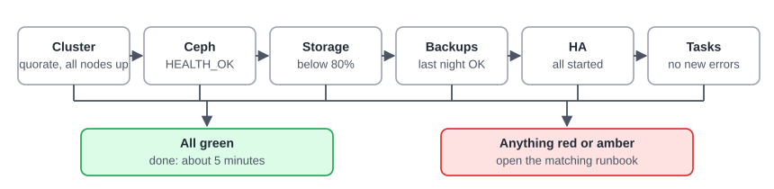

:::note[In a nutshell]
six checks, about five minutes. Do them every morning, and after any change or incident.
:::

| Check | Web UI | Command | Healthy looks like |
|---|---|---|---|
| **Cluster** | Datacenter → Summary | `pvecm status` | `Quorate: Yes`, every node listed |
| **Ceph** | Datacenter → Ceph | `ceph -s` | `HEALTH_OK` |
| **Storage** | Datacenter → Summary (Storage) | `pvesm status` | All `active`, all below 80% used |
| **Backups** | Task log filtered on *Backup* | `pvenode task list --typefilter vzdump --errors 1` | No failed backups since yesterday |
| **HA** | Datacenter → HA | `ha-manager status` | All resources `started`, none in `error` |
| **Tasks** | Bottom panel → Tasks | `pvenode task list --errors 1` | No unexplained failures |

The `pvenode` commands check one node. Run them on each node, or use the web UI's cluster-wide task list.

## Weekly

- **Updates:** Node → Updates. Plan them as maintenance ([3.12 Node Maintenance & Patching](../../user-guide/node-maintenance-patching/)).
- **Disk health:** Node → Disks shows SMART status. Act on anything not `PASSED`.
- **Certificates:** `pvenode cert info` ([3.13 Certificates](../../user-guide/certificates/)).
- **Backup Server:** datastore usage, and that verify, prune and GC jobs ran ([3.9 Snapshots & Backups](../../user-guide/snapshots-backups/)).

**Anything red or amber?** Go to [4.10 Troubleshooting & Runbooks](../../reference/troubleshooting-runbooks/).
