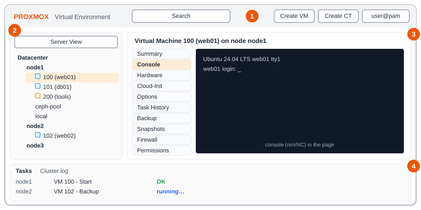
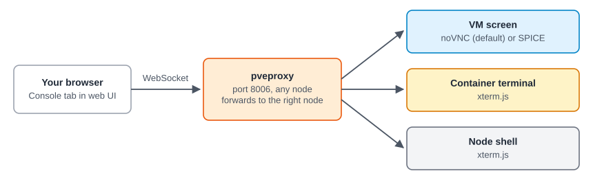

:::note[In a nutshell]
one screen with four areas. The tree on the left picks *what*, the tabs on the right show *details*, and the bottom panel shows *what just happened*.
:::

| # | Area | Use it for |
|---|---|---|
| 1 | **Header** | Search (find a VM by name or ID), Create VM / CT, your user menu |
| 2 | **Resource tree** | Everything in the cluster. Switch between Server, Folder and Pool views. |
| 3 | **Content panel** | Tabs for the selected item: Summary, Console, Hardware, Backup, Snapshots… |
| 4 | **Task log** | Recent tasks and their result. Double-click a task for its full log. |

## What the icons mean

- **Green play icon**: running. **Grey**: stopped. **Padlock**: locked by a task.
- **Node with a red cross**: offline. **Grey question mark**: no status updates (see [4.10 Troubleshooting & Runbooks](../../reference/troubleshooting-runbooks/)).

## Console

The **Console** tab shows a VM's screen (noVNC), or a terminal on a container or node (xterm.js), without needing SSH.
