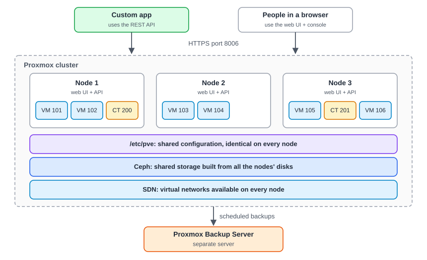
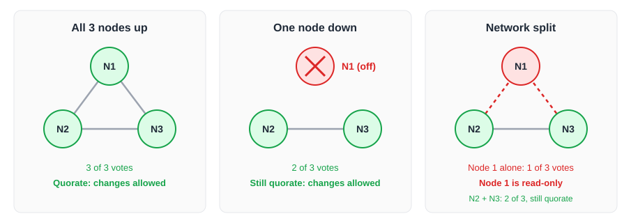
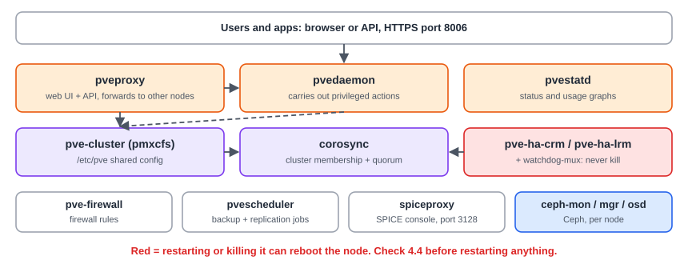
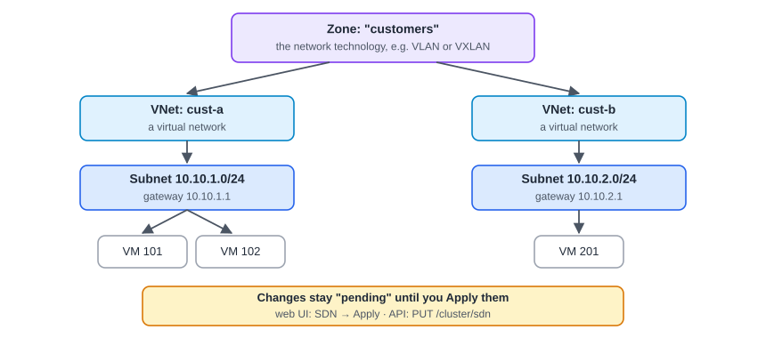
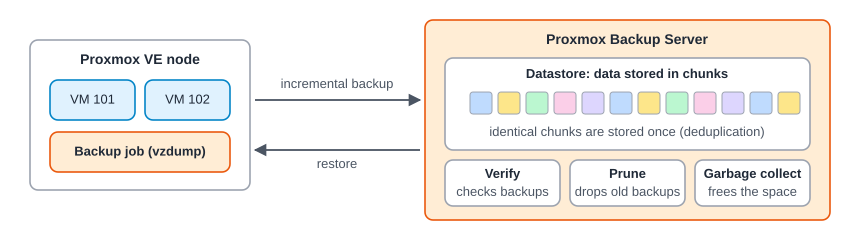
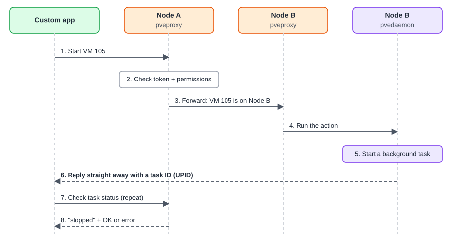

:::note[In a nutshell]
several servers (**nodes**) form a **cluster**. They share their configuration, storage (Ceph) and networks (SDN), and back up to a separate Proxmox Backup Server. Knowing what runs where is what lets you build on it and fix it.
:::

## The big picture

- **Node**: one physical server. A VM runs on one node at a time.
- **Cluster**: nodes joined together. The web UI calls this the **Datacenter**.
- **No central manager**: every node runs the web UI and API. Log in to **any** node at `https://<node>:8006` to manage the whole cluster. The web UI runs on the same REST API a custom app uses, so anything you can click, code can do. See [2.2 Web UI Tour](../../getting-started/web-ui-tour/).

## Quorum: the rule behind most cluster problems

- A cluster only accepts changes while **more than half** of its nodes can see each other.
- Without quorum, running VMs **keep running**, but nothing can be created, changed or started on the nodes that lost it.
- Two-node clusters need an external tie-breaker vote, called a **QDevice**.

:::note
API errors that mention *quorum* or a *read-only* `/etc/pve` point to a cluster health problem, not a bug in your code.
:::

## Shared configuration: `/etc/pve`

A folder that is **kept identical on every node**. It holds VM settings (`qemu-server/<VMID>.conf`), container settings (`lxc/<VMID>.conf`), storage, users, firewall and SDN config. It becomes **read-only** on a node without quorum.

This is also why every VM has a **VMID** (100, 101, …) that is unique across the whole cluster.

## What runs on every node

| Service | Job |
|---|---|
| `pveproxy` | Web UI and API on port 8006. Forwards requests between nodes. |
| `pvedaemon` | Carries out privileged actions |
| `pvestatd` | Collects status and usage |
| `pve-cluster` | Runs the shared `/etc/pve` folder |
| `corosync` | Cluster membership and quorum |
| `pve-ha-crm` / `pve-ha-lrm` | High Availability |
| `pvescheduler` | Scheduled backups and replication |

Which of these are safe to restart is covered in [4.5 Services Reference](../../reference/services/).

## Storage and Ceph

|  | Local storage | Shared storage (e.g. Ceph) |
|---|---|---|
| **Where** | Disks inside one node | Visible to every node |
| **Live migration / HA** | Limited: VMs can't use HA, and moving them copies the whole disk | Yes |

**Ceph** pools the disks of all nodes into one storage that heals itself:

- It keeps **3 copies** of data (by default), so losing a disk or a node loses nothing.
- VM disks are stored as **RBD** images.
- Its services are **MON** (tracks the cluster), **MGR** (monitoring) and **OSD** (one per disk).
- Ceph must be back at `HEALTH_OK` before another node is taken down.

## Networking and SDN

Each node has virtual switches called **bridges** (e.g. `vmbr0`). **SDN** adds networks defined once for the whole cluster:

## Backups and PBS

- **Incremental**: after the first backup, only changes are sent.
- **Deduplicated**: identical data is stored once, even across VMs.
- In Proxmox VE, PBS is added as just another storage.

## What happens on an API call

- You can call **any node**. Proxmox forwards the request to the node that owns the VM.
- Slow actions (start, clone, migrate, backup) return a **task ID (UPID)** straight away.

:::caution
A successful reply means **"the task started"**, not "it's done". Always check the UPID to find out the result. See [4.2 Async Tasks & UPIDs](../../reference/tasks-upids/).
:::

## Ports

| Port | Used for |
|---|---|
| 8006/tcp | Web UI and API |
| 22/tcp | SSH (also used between nodes for cluster actions) |
| 5900–5999/tcp | VNC web console |
| 3128/tcp | SPICE console proxy |
| 5405–5412/udp | Corosync cluster traffic |
| 60000–60050/tcp | Live migration |
| 3300, 6789, 6800–7300/tcp | Ceph monitors and OSDs (Ceph defaults) |
| 8007/tcp | Proxmox Backup Server |
