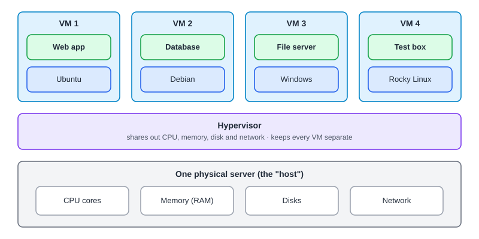
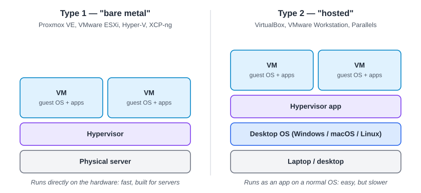
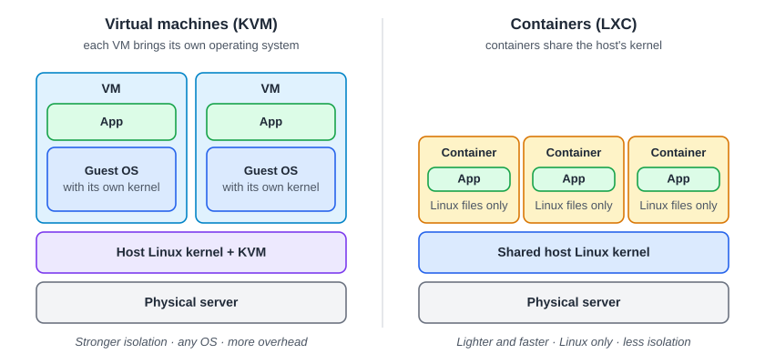
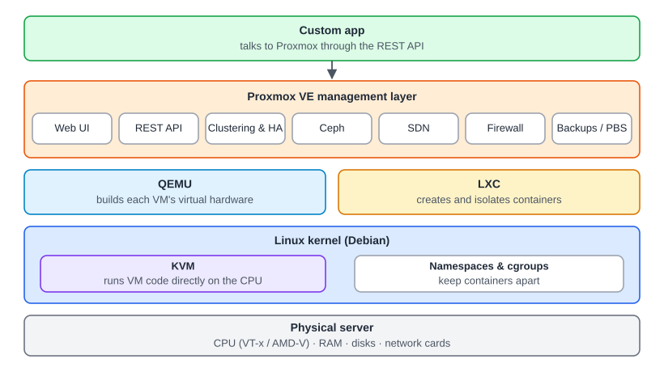

:::note[In a nutshell]
a **hypervisor** turns one physical server into many separate **virtual machines (VMs)**. Proxmox is a hypervisor platform.
:::

## What a hypervisor does

Think of the server as an **apartment building**. Each VM is an apartment with its own door and lock, and the hypervisor is the building manager:

- **Shares** the CPU, memory, disk and network between VMs
- **Isolates** them, so one VM can't see or break another
- **Starts, stops and moves** VMs

The physical server is the **host**. Each VM is a **guest**.

## Type 1 vs Type 2

Proxmox is **Type 1**. It uses **KVM**, a feature of the Linux kernel that turns Linux itself into the hypervisor.

## VMs vs containers

Proxmox can run both:

| Use a… | When you need… |
|---|---|
| **VM** | Strong isolation, Windows or another non-Linux OS, its own kernel, customer workloads |
| **Container (LXC)** | Lightweight Linux services that start in seconds |

:::note
LXC containers behave like small Linux servers. They are **not** Docker containers.
:::

## The Proxmox stack

People and custom apps use the top layer (the web UI and the REST API). Proxmox handles everything below it.

## Need-to-know terms

| Term | Meaning |
|---|---|
| **VT-x / AMD-V** | CPU features that make VMs fast. They must be enabled in the BIOS. |
| **vCPU** | A virtual CPU core given to a VM |
| **VirtIO** | Fast virtual disk and network devices. Built into Linux; Windows needs drivers. |
| **Ballooning** | The host taking back unused memory from a VM |
| **Passthrough** | Giving a VM a real device, such as a GPU |
| **Overcommit** | Handing out more vCPU, RAM or disk than physically exists. CPU overcommit is fine. Running out of real RAM or disk space is not. |

## How Proxmox compares

|  | Proxmox VE | VMware vSphere | Hyper-V | XCP-ng |
|---|---|---|---|---|
| **Built on** | KVM + Debian | Proprietary | Windows Server | Xen |
| **Cost** | Free (open source). Support is optional. | Paid subscription | Included with Windows Server | Free (open source). Support is optional. |
| **Management** | Built-in web UI on every node | vCenter (separate) | Windows tools / SCVMM | Xen Orchestra |
| **Containers** | Yes (LXC) | No | Windows containers | No |
| **Shared storage** | Ceph built in | vSAN | Storage Spaces Direct | XOSTOR |
| **Backup** | Built in + PBS | Third-party | Windows / third-party | Xen Orchestra |
| **API** | REST | vSphere API | PowerShell | XAPI |

### VMware → Proxmox

| VMware | Proxmox |
|---|---|
| ESXi host | Node |
| vCenter | Datacenter view (built in) |
| Datastore / vSAN | Storage / Ceph |
| Port group | Bridge / SDN VNet |
| vMotion | Live migration |
| VMware Tools | QEMU Guest Agent |

Vendor licensing changes often. Last reviewed October 2026.
