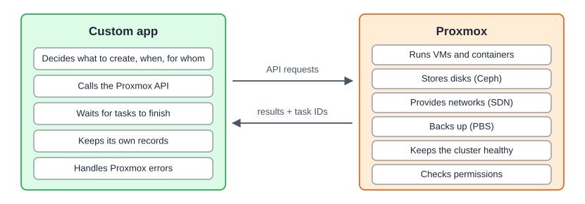

:::note[In a nutshell]
Proxmox VE (PVE) is a free, open-source platform for running VMs and containers across a cluster of servers. You manage it from a web UI or its REST API.
:::

## What you get

| Feature | In plain English |
|---|---|
| **VMs** and **containers** | Run full computers (any OS) or lightweight Linux systems |
| **Web UI** | Manage everything at `https://<node>:8006` |
| **REST API** | Anything the UI can do, code can do too |
| **Clustering + HA** | Many servers managed as one. VMs restart elsewhere if a server dies. |
| **Live migration** | Move a running VM to another server without downtime |
| **Ceph** | Shared storage that survives disk and server failures |
| **SDN** | Virtual networks defined once, available on every server |
| **Backups + PBS** | Scheduled, space-saving backups |
| **Firewall, users & permissions** | Control traffic, and control who can do what |

## Who makes it, and what it costs

- Made by **Proxmox Server Solutions GmbH** (Vienna, Austria), and around since 2008.
- **Free and open source** (AGPLv3), with every feature included.
- An optional **subscription** gives you better-tested updates (the enterprise repository) and official support.

## Version 8 vs 9

Many sites run both during a migration.

:::caution
**PVE 8 reached end of life in August 2026.** It no longer gets security updates, so PVE 8 clusters should be upgraded to 9.
:::

|  | PVE 8 | PVE 9 |
|---|---|---|
| **Released** | June 2023 | August 2025 (latest: 9.2, May 2026) |
| **Built on** | Debian 12 "Bookworm" | Debian 13 "Trixie" |
| **Supported until** | **August 2026 (ended)** | Not announced yet (roughly as long as Debian 13) |
| **Ceph** | Quincy, Reef or Squid | Squid 19.2 (Tentacle 20.2 also offered from 9.2) |
| **Pairs with** | PBS 3 | PBS 4 |

**New in 9:**

- **HA rules** replace HA groups: node affinity and resource affinity (keep VMs together or apart)
- **SDN fabrics** for routed networks between nodes
- **Snapshots on shared thick LVM** (technology preview)
- Containers are **unprivileged by default**, even through the API
- **Permission changes:** `VM.Monitor` removed, new `VM.GuestAgent.*` privileges
- **Removed:** GlusterFS storage, and support for very old containers (cgroup v1)

:::note
The API is mostly the same in both versions. Differences that matter are flagged on the relevant pages and collected in [4.9 Upgrading from PVE 8 to 9](../../reference/upgrading-8-to-9/). Sources: the Proxmox VE [Roadmap](https://pve.proxmox.com/wiki/Roadmap), [FAQ](https://pve.proxmox.com/wiki/FAQ) and [8 to 9 upgrade guide](https://pve.proxmox.com/wiki/Upgrade_from_8_to_9).
:::

## Who does what

When a custom app runs on top of Proxmox, the work splits like this:

