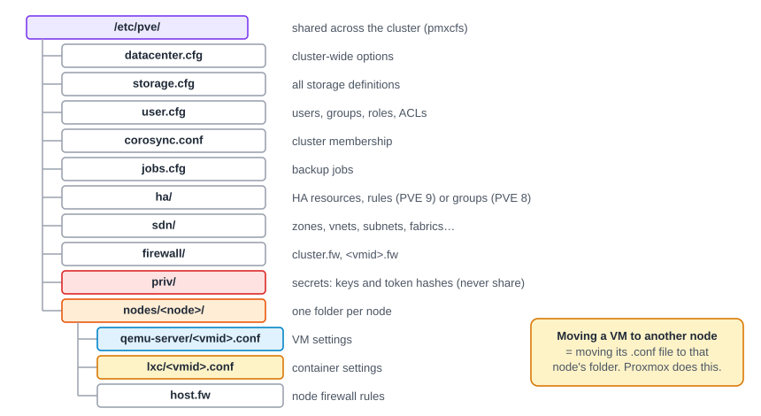

:::note[In a nutshell]
all cluster configuration lives as small text files in `/etc/pve`, kept identical on every node. When something goes wrong, start with the **task log**, then the **journal** of the service involved. Read config files freely, but **change them through the web UI, CLI or API, not a text editor.**
:::

## Configuration: `/etc/pve`



Shortcuts: `/etc/pve/qemu-server`, `/etc/pve/lxc` and `/etc/pve/local` all point into the current node's folder. Node networking is the exception: it lives in `/etc/network/interfaces` on each node and isn't shared.

### A VM config, explained

```text title="/etc/pve/qemu-server/101.conf"
agent: 1                                   # QEMU guest agent enabled
boot: order=scsi0;net0                     # boot from disk, then network
cores: 2
cpu: x86-64-v2-AES
ide2: ceph-pool:vm-101-cloudinit,media=cdrom   # cloud-init drive
ipconfig0: ip=10.0.10.21/24,gw=10.0.10.1
memory: 4096                               # MiB
name: web01
net0: virtio=BC:24:11:3A:5F:01,bridge=vmbr0,firewall=1,tag=10
scsi0: ceph-pool:vm-101-disk-0,discard=on,iothread=1,size=32G
scsihw: virtio-scsi-single
sshkeys: ssh-ed25519%20AAAA...             # stored URL-encoded
tags: customer-a;web

[PENDING]                                  # changes waiting for a reboot
memory: 8192

[pre-upgrade]                              # a snapshot: the config as it was then
snaptime: 1727000000
memory: 4096
...
```

`qm config 101` shows the same thing, and the API's `GET …/config` returns the same keys as JSON. Snapshots and pending changes come from their own endpoints.

### Other files worth knowing

| File | Holds | API |
|---|---|---|
| `storage.cfg` | Every storage: type, ID, content types, nodes | `GET /storage` |
| `user.cfg` | Users, groups, roles, ACLs, token IDs (not secrets) | `/access/…` |
| `datacenter.cfg` | Cluster defaults: keyboard, migration network, HA shutdown policy, VMID range for `nextid` | `GET /cluster/options` |
| `jobs.cfg` | Backup jobs | `GET /cluster/backup` |
| `ha/resources.cfg`, `ha/rules.cfg` | HA resources and rules (PVE 9; `groups.cfg` on PVE 8) | `/cluster/ha/…` |
| `sdn/*.cfg` | Zones, VNets, subnets, controllers, fabrics | `/cluster/sdn/…` |
| `firewall/cluster.fw`, `firewall/<vmid>.fw` | Cluster and per-VM firewall rules | `…/firewall/…` |
| `corosync.conf` | Cluster members and network links | `GET /cluster/config/nodes` |

## Logs

| What | Where |
|---|---|
| Task logs | Web UI task panel, `pvenode task log <UPID>`, or `GET /nodes/{node}/tasks/{upid}/log` |
| Web UI / API / actions | `journalctl -u pveproxy -u pvedaemon` |
| Status collection | `journalctl -u pvestatd` |
| Cluster and quorum | `journalctl -u corosync -u pve-cluster` |
| HA | `journalctl -u pve-ha-crm -u pve-ha-lrm` |
| Ceph | `journalctl -u ceph-osd@<id>`, `-u ceph-mon@<node>`, or `/var/log/ceph/` |
| Firewall | Firewall → Log, or `/var/log/pve-firewall.log` |
| Previous boot (after a crash or fence) | `journalctl -b -1` |

## Gotchas

- **Don't edit by hand.** The web UI, CLI and API take locks and check values. A hand edit can race with a running task.
- **No quorum means read-only.** Any write to `/etc/pve` fails while the node lacks quorum.
- **It's not a general filesystem.** It's built for small config files. Don't store scripts, ISOs or large data there.
- `priv/` holds secrets. Never copy it into tickets, chat or backups people can read.
