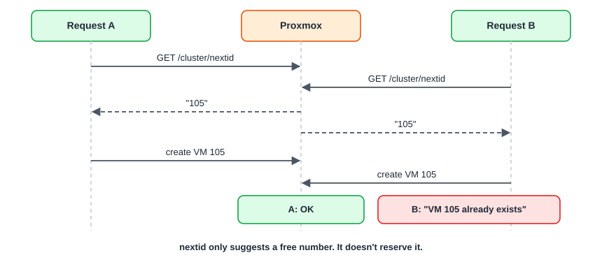

:::note[In a nutshell]
the errors developers hit most often, what they really mean, and what to do about them. Most come from three things: **tasks** that fail after the API said OK, **locks** from operations overlapping, and **races** between parallel requests.
:::

## The VMID race

- **Fix:** treat "already exists" as "try the next ID" and retry, or hand out IDs from the custom app's own range.
- A cluster-wide range for `nextid` can be set in `datacenter.cfg` (`next-id: lower=…,upper=…`).

## Error messages, decoded

| You see | It means | Do this |
|---|---|---|
| `VM 101 is locked (backup)` (or `clone`, `migrate`, `snapshot`…) | Another task holds the VM | Wait for that task, then retry. Only run `qm unlock` if you're sure the task is dead. |
| `can't lock file '/var/lock/qemu-server/lock-101.conf' - got timeout` | Two requests changed the same VM at once | Send one change at a time per VM |
| `trying to acquire cfs lock 'storage-…'` | Cluster-wide lock contention, or no quorum | Retry with backoff. Check quorum. |
| `cluster not ready - no quorum?` | This node can't see a majority | A cluster health problem, not your code (see [1.3 Architecture Overview](../../introduction/architecture-overview/)) |
| `VM 105 already exists` | The VMID race above, or an old VM | Pick another ID |
| `401 authentication failure` | Wrong token or password, or a ticket older than 2 hours | Check the token format. Renew tickets. |
| `403 Permission check failed (/vms/101, VM.PowerMgmt)` | Missing privilege on that path | Add it (see [4.3 Permission Matrix](../permission-matrix/)) |
| `400 Parameter verification failed` | A bad or missing parameter | The `errors` field names each one |
| `595` / `596` | The node you called couldn't reach the node that owns the VM | Check that node is up. Retry against another node. |
| Clone fails saying a linked clone isn't possible | The source isn't a template, or the storage can't do linked clones | Clone a template, or use `full=1` |
| `timeout waiting on systemd` on start | The node is slow, or the VM is stuck starting | Read the task log. Check the node load. |
| Shutdown task ends with a timeout | The guest ignored the shutdown request | Install the guest agent, or follow up with `stop` |

## Silent gotchas (no error at all)

- **Task "succeeded" but nothing changed:** you checked the HTTP reply, not the task's `exitstatus` (see [4.2 Async Tasks & UPIDs](../tasks-upids/)).
- **Config change made but not applied:** it's *pending* until a Proxmox reboot.
- **SDN change made but not applied:** it needs `PUT /cluster/sdn`.
- **Cloud-init key not working:** `sshkeys` wasn't URL-encoded.
- **Firewall rules ignored:** the NIC is missing `firewall=1`, or the datacenter firewall is off.
- **Container created privileged on PVE 8:** the API default; pass `unprivileged=1`.

## Safe patterns

- **One operation per VM at a time.** Queue actions per VMID in the custom app.
- **Retry only safe things:** reads, and actions you can confirm didn't happen.
- **Check before acting:** read `status/current` before start or stop, and the task list before retrying.
