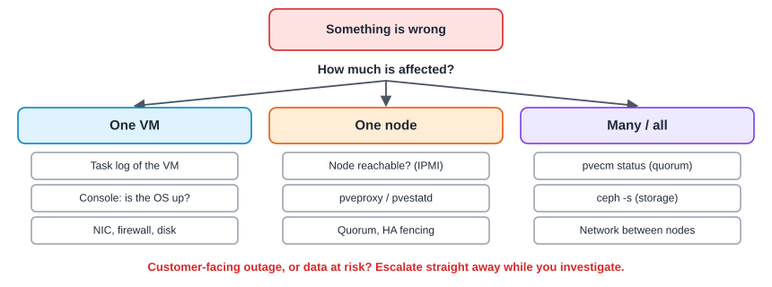
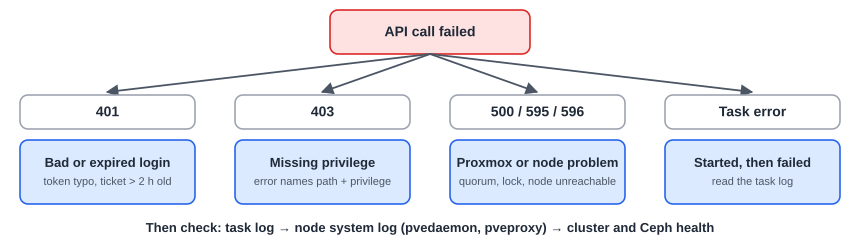

:::note[In a nutshell]
work out the **scope** first (one VM, one node, or many), find the likely cause, then follow the matching runbook: **Symptoms → Check → Fix → Escalate if**. Most problems are explained in the **task log**.
:::

## Triage

1. **Write down the time** and what's affected.
2. **Check scope:** one VM, one node, or many?
3. **Look at the task log** around that time.
4. **Find the symptom** below, or follow the matching runbook.
5. **Collect the basics** before changing anything (see [4.11 Escalation Checklist](../escalation-checklist/)).

## When an API call fails

The full list of error messages, and what they really mean, is in [4.7 Errors & Gotchas](../errors-gotchas/).

## Symptom → cause → fix

### VM problems

| Symptom | Likely cause | Check / fix |
|---|---|---|
| VM won't start | Storage unavailable, not enough RAM on the node, a leftover lock | Task log. `pvesm status`. Node memory. `qm config 101 \| grep lock` |
| VM starts but has no network | Wrong bridge/VNet or VLAN tag, SDN not applied, firewall | NIC settings. SDN pending changes. Firewall log. |
| No IP shown for VM | Guest agent not running, or (PVE 9) missing `VM.GuestAgent.Audit` | `qm guest cmd 101 ping`. Check permissions. |
| Cloud-init settings ignored | Not first boot, no cloud-init drive, unencoded `sshkeys` | The Cloud-Init tab. `cloud-init status` inside the VM. |
| Shutdown hangs | The guest ignores ACPI, no agent | Install the agent. Use `stop` after a timeout. |
| VM suddenly slow | Ceph recovering, node overloaded, storage nearly full | `ceph -s`. Node summary graphs. `pvesm status`. |
| VM froze | Thin pool or Ceph full, or storage lost | Storage usage. Ceph health. System log. |

### Cluster problems

| Symptom | Likely cause | Check / fix |
|---|---|---|
| Every change fails, "no quorum" | The node lost contact with the majority | `pvecm status`. Check the corosync network. |
| Node shows a grey question mark | `pvestatd` stuck, or the node is unreachable | `systemctl status pvestatd` on that node |
| Calls through one node give 595/596 | The target node is down or unreachable from the node you called | Call the target node directly. Check the network between nodes. |
| A node rebooted on its own | HA fencing after it lost quorum | `journalctl -b -1 -u watchdog-mux -u pve-ha-lrm` (last boot) |

### Migration, HA and backups

| Symptom | Likely cause | Check / fix |
|---|---|---|
| Live migration refused | Local device or ISO, CPU type `host` across different CPUs | The task log names the blocker |
| Migration very slow | Disk on local storage being copied, or a slow migration network | Use shared storage, or a dedicated migration network |
| HA VM not restarted | Not an HA resource, no quorum, resource in `error` | `ha-manager status` |
| Backup failed | PBS unreachable or full, VM locked, snapshot mode failed | Backup task log. PBS datastore usage. |

## Runbooks

### Node down or unreachable

**Symptoms:** Node shows a red cross or grey question mark. Its VMs are unreachable or shown as unknown.

**Check:**

- Ping the node, then try SSH, then IPMI.
- From another node: `pvecm status` and `ha-manager status`.
- Grey question mark only (node is up): `systemctl status pvestatd pveproxy`.

**Fix:**

- Grey question mark: `systemctl restart pvestatd`.
- Node truly down: HA VMs restart elsewhere within a few minutes. Start important non-HA VMs elsewhere only **after** confirming the node is really off.
- Bring the node back via IPMI.

**Escalate if:** The node won't boot, shows hardware errors, or more than one node is affected.

### Cluster lost quorum

**Symptoms:** `cluster not ready - no quorum?`. VMs can't be started. `/etc/pve` is read-only.

**Check:**

- `pvecm status` on each node: `Quorate`, and the votes each one sees.
- `journalctl -u corosync --since "30 min ago"`: links down, token timeouts.
- The network between nodes, especially the corosync links.

**Fix:** Restore the network or bring nodes back. Quorum returns by itself.

**Escalate if:** A majority of nodes can't be brought back. **Don't** force quorum (`pvecm expected 1`) without a senior admin: on a split cluster it can cause the same VM to run twice and corrupt data.

### Ceph not healthy

**Symptoms:** `HEALTH_WARN` / `HEALTH_ERR`. VMs slow or frozen.

**Check:** `ceph -s`, `ceph health detail`, `ceph osd tree`, `ceph osd df tree`

**Fix:**

- OSD down on a healthy disk: `systemctl restart ceph-osd@<id>`.
- Failed disk: replace it ([3.5 Ceph](../../user-guide/ceph/)).
- Forgotten `noout`: `ceph osd unset noout`.
- Recovering: wait. No more reboots.

**Escalate if:** `HEALTH_ERR`, inactive or down PGs, `nearfull` / `full`, or OSDs down on more than one node.

### VM won't start

**Symptoms:** Start fails, or the VM goes straight back to stopped.

**Check:**

- The start task's log: it nearly always names the cause.
- Locked? Storage active (`pvesm status`)? Enough free RAM on the node? Quorum?

**Fix:** Clear a stale lock ([3.1 VM Lifecycle](../../user-guide/vm-lifecycle/)). Fix or free the storage. Start the VM on a node with more memory. Remove a missing ISO or device.

**Escalate if:** The log shows disk or storage errors, or several VMs fail the same way.

### Storage full

**Symptoms:** VMs freeze. Backups or disk creation fail with "no space". Ceph shows `nearfull` / `full`.

**Check:** `pvesm status`, `ceph df`, `lvs` (LVM-thin), `zpool list` (ZFS), `df -h /` (the node's own disk)

**Fix:**

- Delete old snapshots and unused disks. Move backups off the full storage.
- Node root disk full: `journalctl --vacuum-time=7d`, and clear old dumps in `/var/lib/vz/dump`.

**Escalate if:** Ceph is `full`, or space can't be recovered quickly.

### Backup failed

**Symptoms:** A backup job is reported as failed (task log or notification).

**Check:** The backup task log (which VM, which error). Is the backup storage reachable and not full? Was the VM locked by another task?

**Fix:** Fix the storage issue, then **Backup now** for that VM. Stale `backup` lock with no backup running: `qm unlock <id>`.

**Escalate if:** The same VM fails twice in a row, or the Backup Server itself is unhealthy.

### HA did not recover a VM

**Symptoms:** A node failed but its VM didn't start elsewhere. Or a node rebooted on its own (fenced).

**Check:** `ha-manager status`: is it an HA resource, and in what state? Quorum on the surviving nodes? For a fenced node: `journalctl -b -1 -u pve-ha-lrm -u watchdog-mux -u corosync`.

**Fix:** Resource in `error`: `ha-manager set vm:101 --state disabled`, fix the cause, then `--state started`. Not an HA resource: start it manually on a healthy node.

**Escalate if:** Nodes keep fencing, or the cause is the cluster network.

### Web UI not loading

**Symptoms:** `https://node:8006` doesn't load, shows a certificate error, or logins fail.

**Check:** Does another node's web UI work? `systemctl status pveproxy pvedaemon pve-cluster`. `pvenode cert info`: has the certificate expired?

**Fix:**

- `systemctl restart pveproxy`
- Expired certificate: `pvenode acme cert renew`, or `pvecm updatecerts --force` and restart `pveproxy`.
- Broken page after an update: Ctrl+Shift+R.
- One user can't log in: wrong realm, 2FA locked ([3.8 Users, Roles & Permissions](../../user-guide/users-roles-permissions/)), or a directory problem.

**Escalate if:** `pve-cluster` won't start, or every node is affected.

### VM has no network

**Symptoms:** The VM runs but can't be reached, or can't reach anything.

**Check:** Console: OS up, IP set? NIC bridge/VNet and VLAN tag? SDN changes pending? VM firewall log? VLAN allowed on the switch?

**Fix:** Correct the NIC settings, apply SDN, or fix the firewall rule. See [3.6 Networking](../../user-guide/networking/).

**Escalate if:** Several VMs on the same network are affected (likely a switch or SDN problem).

## Where to look, in order

1. **Task log** of the failed action (web UI bottom panel, `pvenode task log <UPID>`, or `GET …/tasks/{upid}/log`).
2. **System log** on the node that ran the task: `journalctl -u pvedaemon -u pveproxy --since "10 min ago"`.
3. **Cluster health:** `pvecm status`, `ha-manager status`.
4. **Storage health:** `ceph -s`, `pvesm status`.
