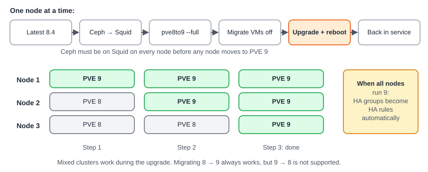

:::caution
**PVE 8 reached end of life in August 2026** and no longer gets security updates. Any cluster still on 8 should be upgraded.
:::

:::note[In a nutshell]
the upgrade is done **one node at a time** while VMs keep running on the other nodes. Ceph must be on Squid first, and `pve8to9` must run clean. Operators follow the procedure. Developers check custom apps against the API and permission changes **before** the first node is upgraded.
:::

## The upgrade at a glance



## What changed from 8 to 9

| Change | Since | Affects | What to do |
|---|---|---|---|
| PVE 8 end of life | Aug 2026 | Everyone | Upgrade |
| Debian 13 base, new kernel | 9.0 | Operators | Check old or unusual hardware before upgrading |
| Network interface names may change | 9.0 | Operators | Pin names first with `pve-network-interface-pinning`. Keep IPMI access. |
| VirtIO NIC MTU follows the bridge | 9.0 | Everyone | An unset MTU now inherits the bridge MTU instead of 1500. Set `mtu=1500` where it matters (`pve8to9` lists affected NICs). |
| `VM.Monitor` privilege removed | 9.0 | Developers | Custom roles using it break, and guest agent calls (e.g. reading IPs) return `403`. Use `VM.GuestAgent.*` (e.g. `VM.GuestAgent.Audit`), and `Sys.Audit` for monitor access. |
| New `VM.Replicate` privilege | 9.0 | Everyone | Managing replication jobs needs it on `/vms/{vmid}` |
| Containers unprivileged by default (API and CLI too) | 9.0 | Everyone | Creating a privileged container needs `Sys.Modify` on `/`. Pass `unprivileged=1` explicitly on both versions. |
| HA groups → HA rules | 9.0 | Everyone | Groups become **node affinity rules** once all nodes run 9. `nofailback` becomes the resource option `failback`. Move code from `/cluster/ha/groups` to `/cluster/ha/rules`. |
| `maxfiles` backup option removed | 9.0 | Everyone | Use `prune-backups` (`keep-*`) |
| GlusterFS storage removed | 9.0 | Operators | Move disks off GlusterFS first |
| cgroup v1 removed | 9.0 | Operators | Containers with systemd 230 or older won't start |
| SDN fabrics | 9.0 | Operators | New way to build routed networks between nodes. 9.2 adds WireGuard and BGP fabrics. |
| Snapshots on shared thick LVM | 9.0 | Operators | Technology preview, for iSCSI/FC SAN storage |
| Test repository renamed | 9.0 | Operators | `pvetest` is now `pve-test` |
| OCI images for containers | 9.1 | Everyone | Containers can be created from OCI (Docker-style) images |
| Dynamic HA load balancing | 9.2 | Operators | HA can move VMs automatically to balance load |
| HA disarm / arm | 9.2 | Operators | Safe cluster-network maintenance without fencing (see [3.12 Node Maintenance & Patching](../../user-guide/node-maintenance-patching/)) |
| VNC console endpoints hardened (PSA-2026-00014-1) | 9.2 | Developers | Clients connecting **directly** to a VNC port opened via `vncproxy` / `vncshell` must adapt. Check console code against the advisory. |
| HA during create/restore needs `Sys.Console` | 9.2 | Developers | Add `Sys.Console`, or add HA in a separate step |
| Reading the cloud-init password needs `VM.Config.Cloudinit` | 9.2 | Developers | Add the privilege where needed |
| Ceph Tentacle 20.2 offered | 9.2 | Operators | Squid 19.2 remains supported |
| Faster cluster recovery (lower corosync token coefficient) | 9.2, new clusters | Operators | New clusters re-form membership faster after a node failure |

## For developers: custom app readiness checklist

- No custom role still uses `VM.Monitor`.
- Container creation passes `unprivileged=1`.
- No code uses `/cluster/ha/groups` or `nofailback`.
- No backup calls use `maxfiles`.
- Console code tested against PVE 9.2.
- The custom app tolerates a **mixed cluster** during the upgrade (some nodes on 8, some on 9).
- Tested end-to-end against a PVE 9 lab cluster.

## For operators: the procedure

### Before the first node

- Every node on the **latest PVE 8.4** (`pveversion` shows at least 8.4.1).
- **Ceph on Squid (19.2)** on every node (`ceph --version`) *before* any node moves to 9.
- `pve8to9 --full` runs clean on every node. Re-run it after each fix.
- Tested **backups** of all VMs and containers.
- IPMI / iDRAC console access to each node. Never run the upgrade from the web UI's console. Use `tmux` if SSH is the only way in.
- At least 5 GB (ideally 10 GB+) free on `/`.
- Network interface names pinned. Third-party storage plugins confirmed compatible with PVE 9.

### On each node

```bash
# 0. Move running VMs to other nodes first (see 3.12)
apt update && apt dist-upgrade && pveversion     # must show 8.4.1 or newer
pve8to9 --full                                   # fix everything it reports

# 1. Point Debian repositories at Trixie
sed -i 's/bookworm/trixie/g' /etc/apt/sources.list

# 2. Switch Proxmox and Ceph repositories to their PVE 9 / Trixie versions
#    (new deb822 .sources files; see the official guide for the exact content)

# 3. Upgrade and reboot
apt update && apt dist-upgrade
pve8to9                                          # check again
reboot
```

Follow the official [Upgrade from 8 to 9](https://pve.proxmox.com/wiki/Upgrade_from_8_to_9) guide for the exact repository files and the config-file prompts during the upgrade.

### After the upgrade

- Force-reload the web UI (Ctrl+Shift+R).
- Once **all** nodes run 9: check that HA groups became rules (`journalctl -eu pve-ha-crm` if not).
- Ceph may show `HEALTH_ERR` about **insecure key types** after the first monitor node reboots. Services keep working. Finish the upgrade, then follow Proxmox's key migration steps.
- Optional: `apt modernize-sources` converts old repository files to the new format.

### Mixed clusters during the upgrade

- Migrating a VM from **8 to 9 always works**. From 9 to 8 it is **not supported**.
- For actions on a node that's still on 8, use that node's web UI or API if you see odd errors.

Sources: Proxmox VE [Roadmap](https://pve.proxmox.com/wiki/Roadmap) (known issues for 9.0–9.2), [Upgrade from 8 to 9](https://pve.proxmox.com/wiki/Upgrade_from_8_to_9), [FAQ](https://pve.proxmox.com/wiki/FAQ). Last checked October 2026.
