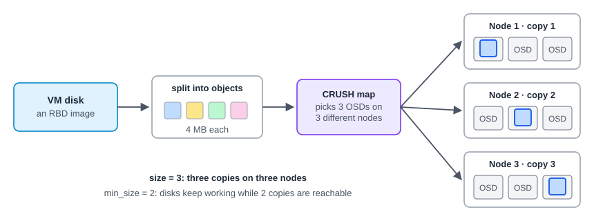
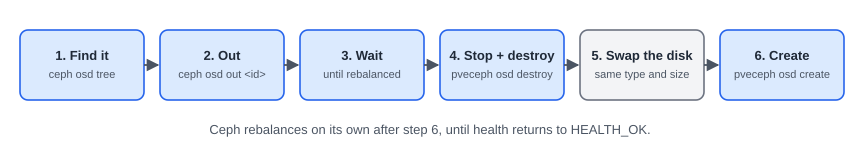

:::note[In a nutshell]
Ceph spreads every VM disk across the disks of all nodes and keeps **3 copies**. A disk or a whole node can die and VMs keep running, while Ceph quietly re-copies the missing data. Keep it at `HEALTH_OK`, keep it below 80% full, and change one node at a time.
:::

## How Ceph stores a VM disk



| Part | What it is |
|---|---|
| **OSD** | One per physical disk. Stores the data. |
| **MON** (monitor) | Keeps the map of the Ceph cluster. Usually 3, and a majority must be up, just like Proxmox quorum. |
| **MGR** (manager) | Monitoring and the dashboard. One active, others on standby. |
| **Pool** | A logical storage area with its own copy rules. Added to Proxmox as an RBD storage. |
| **Placement group (PG)** | A bucket of objects. Ceph moves PGs around, not single files. |
| **CRUSH** | The rules that decide which OSDs hold each copy (by default, on different nodes). |

## Is Ceph healthy?


Check it in **Datacenter → Ceph** (or **Node → Ceph**), or run `ceph -s` on any node.

| You see | It means | Effect on VMs | Do this |
|---|---|---|---|
| `osd down` | A disk or node is offline | None while 2+ copies remain | Check the node and disk. Restart the OSD, or replace the disk (below). |
| `recovering` / `backfilling` | Ceph is re-copying data | Disks are slower until it finishes | Wait. No more reboots, no heavy jobs. |
| `noout flag(s) set` | Maintenance flag still on | None | Expected during maintenance. Otherwise `ceph osd unset noout`. |
| `slow ops` | A disk or the network can't keep up | Slow disks | `ceph health detail` names the OSD. Check its SMART status and network. |
| `nearfull` (85%) | Running out of space | Warning | Free space or add disks now. |
| `full` (95%) | Writes are blocked | **VMs freeze** | Escalate immediately. |
| PGs `inactive` / `undersized` below `min_size` | Too few copies reachable | **I/O to some disks stops** | Escalate immediately. |

## Capacity in one line

With 3 copies, **usable space ≈ raw space ÷ 3**. Keep usage **below about 80%**, so Ceph has room to recover when a disk fails.

## Rebooting a node

```bash
ceph osd set noout     # don't start re-copying data while the node is briefly away
# ... migrate VMs off, reboot the node, wait until it's back ...
ceph osd unset noout   # back to normal
ceph -s                # wait for HEALTH_OK before touching the next node
```

The full procedure is in [3.12 Node Maintenance & Patching](../node-maintenance-patching/).

## Replacing a failed disk



```bash
ceph osd tree                        # find the OSD marked "down"; note its id and node
ceph osd out 7                       # stop placing data on it (if not out already)
ceph -s                              # wait until rebalancing has finished
ceph osd ok-to-stop 7                # must say it's safe
pveceph stop --service osd.7
pveceph osd destroy 7 --cleanup      # remove the OSD and wipe the old disk
# ... physically replace the disk with one of the same type and size ...
pveceph osd create /dev/sdX          # on the same node, using the new disk
ceph crash archive-all               # clear old crash reports once HEALTH_OK
```

In the web UI, the same steps are in **Node → Ceph → OSD** (Out, Stop, More → Destroy, Create: OSD).

:::note
An OSD is down but its disk looks healthy (SMART `PASSED`)? Try `systemctl restart ceph-osd@7` and read `journalctl -u ceph-osd@7` before replacing anything.
:::

## Quick reference

| Task | Web UI | CLI | API |
|---|---|---|---|
| Overall status | Datacenter → Ceph | `ceph -s` | `GET /cluster/ceph/status` |
| What's wrong, in detail | Datacenter → Ceph | `ceph health detail` | (status, `health.checks`) |
| Disks per node | Node → Ceph → OSD | `ceph osd tree` | `GET /nodes/{node}/ceph/osd` |
| Space | Node → Ceph → Pools / OSD | `ceph df`, `ceph osd df tree` | `GET /nodes/{node}/ceph/pool` |

## Gotchas

- **One node at a time.** Always wait for `HEALTH_OK` before rebooting the next node.
- **Never let Ceph fill up.** Recovering from `full` is painful.
- Ceph needs a **fast, dedicated network**. A slow or shared link makes every VM disk slow.
- **Versions:** PVE 9 uses Ceph Squid (19.2), and PVE 9.2 also offers Tentacle (20.2). Ceph must be on Squid *before* a node is upgraded from PVE 8 to 9.
