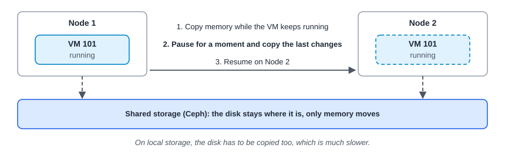
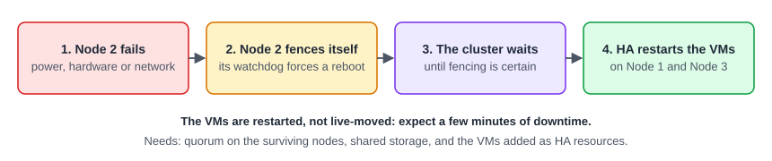

:::note[In a nutshell]
**migration** moves a VM to another node on purpose, usually without downtime. **HA** restarts VMs on another node automatically when their node dies, with a few minutes of downtime.
:::

## Live migration

| Type | Downtime | Notes |
|---|---|---|
| **Live** (VM running) | A blink | Fast on shared storage (Ceph). Possible with local disks (`with-local-disks`), but slow. |
| **Offline** (VM stopped) | n/a | Always works if the target can reach the disks |
| **Container** | Seconds | Restart mode only: stop, move, start |

**What blocks live migration:** passed-through devices (USB, PCI/GPU), an ISO on local storage still attached, or CPU type `host` on nodes with different CPUs.

## High Availability (HA)

- Only VMs added as **HA resources** are protected.
- **Fencing** makes sure the failed node is truly off before its VMs start elsewhere, so a VM never runs twice.
- HA needs **3+ nodes** (or 2 plus a QDevice) and **shared storage**.

| | PVE 8 | PVE 9 |
|---|---|---|
| **Choosing nodes** | HA *groups* (preferred nodes with priorities) | HA *rules*: **node affinity** (preferred nodes) and **resource affinity** (keep VMs together or apart) |
| **Upgrade** | Groups are converted to rules automatically once every node runs PVE 9 | |

PVE 9.2 adds **dynamic load balancing** (HA VMs are moved based on live load) and HA **arm/disarm** for maintenance (see [3.12 Node Maintenance & Patching](../node-maintenance-patching/)).

### HA resource states

| State | Meaning |
|---|---|
| `started` | HA keeps it running, and restarts it elsewhere if needed |
| `stopped` | HA keeps it off |
| `disabled` | Stopped, and HA ignores it (used to recover from errors) |
| `ignored` | HA doesn't manage it at all for now |
| `error` | HA gave up. Fix the cause, then `--state disabled` followed by `--state started`. |

## Emptying a node for maintenance

1. Put the node in **maintenance mode**: `ha-manager crm-command node-maintenance enable node2`. HA VMs move off automatically.
2. Migrate any non-HA VMs off (**Node → Bulk Migrate**).
3. Do the work, then `ha-manager crm-command node-maintenance disable node2`.

With Ceph, also set `noout`. The full procedure is in [3.12 Node Maintenance & Patching](../node-maintenance-patching/).

## Quick reference

| Task | Web UI | CLI | API |
|---|---|---|---|
| Live-migrate a VM | VM toolbar → Migrate | `qm migrate 101 node2 --online` | `POST …/qemu/{vmid}/migrate` (`target`, `online=1`) |
| Migrate a container | CT toolbar → Migrate | `pct migrate 200 node2 --restart` | `POST …/lxc/{vmid}/migrate` (`restart=1`) |
| Empty a node | Node → Bulk Migrate | `ha-manager crm-command node-maintenance enable node2` | n/a |
| Add a VM to HA | Datacenter → HA → Add | `ha-manager add vm:101` | `POST /cluster/ha/resources` (`sid=vm:101`) |
| HA status | Datacenter → HA | `ha-manager status` | `GET /cluster/ha/status/current` |
| Recover from error | HA → Edit → state | `ha-manager set vm:101 --state disabled` then `--state started` | `PUT /cluster/ha/resources/vm:101` |
| Cluster and quorum status | Datacenter → Summary | `pvecm status` | `GET /cluster/status` |

## Gotchas

- **HA is a restart, not a live move.** Apps inside the VM must cope with a reboot.
- Start, stop and migrate requests for HA VMs go **through the HA manager**, so the reply says "requesting…" and the action happens a moment later.
- Live migration between **different CPU vendors** (Intel to AMD) can hang VMs. Avoid it.

:::caution
Never kill `pve-ha-crm`, `pve-ha-lrm` or `watchdog-mux`. Proxmox warns this can trigger an immediate node reboot.
:::
