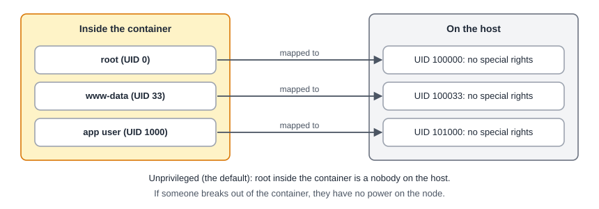

:::note[In a nutshell]
containers are lightweight Linux systems that share the node's kernel. They start in seconds and use little memory, but they are less isolated than VMs and can't live-migrate. See [1.1 Virtualization & Hypervisors 101](../../introduction/virtualization-hypervisors-101/) for VMs vs containers.
:::

## Unprivileged by default

- Always use **unprivileged** containers. Privileged ones give root inside the container real root rights on the node.
- One side effect: files from the host (bind mounts) can appear as owned by `nobody` inside the container. Fix this with ID mapping or file ownership on the host.

:::note
**Version 8 vs 9:** on PVE 8 the **API and CLI** create a *privileged* container unless you pass `unprivileged=1`. Only the web UI defaults to unprivileged. On PVE 9, containers are unprivileged by default everywhere, and creating a privileged one needs the `Sys.Modify` privilege. Always pass `unprivileged=1` explicitly.
:::

## How containers differ from VMs

|  | VM | Container |
|---|---|---|
| **Created from** | ISO install, or a VM template | A container template (a packed root filesystem). PVE 9.1+ can also use OCI images. |
| **Disks** | `scsi0`, `virtio0` … | `rootfs` plus mount points (`mp0`, `mp1` …) |
| **Migration** | Live | **Restart mode only**: stopped, moved, started (a few seconds of downtime) |
| **Console** | Screen (noVNC) | Text terminal (xterm.js). `pct enter` from the node. |
| **Extra features** | n/a | `nesting`, `keyctl`, `fuse`, turned on per container under Options → Features |

## Creating a container

1. **Get a template:** on a storage with *CT Templates* content, choose **Templates** and download one (e.g. Debian 12).
2. **Create CT:** pick the template, root disk size, CPU, memory and network. Leave *Unprivileged* ticked.
3. **Start it** and open the console.

## Quick reference

| Task | API | CLI |
|---|---|---|
| List / download templates | `GET /nodes/{node}/aplinfo`, `POST …/aplinfo` | `pveam available`, `pveam download local debian-12-…` |
| Create | `POST /nodes/{node}/lxc` (`ostemplate`, `unprivileged=1`) | `pct create 200 local:vztmpl/… --unprivileged 1` |
| Start / shutdown / stop | `POST /nodes/{node}/lxc/{vmid}/status/start\|shutdown\|stop` | `pct start\|shutdown\|stop 200` |
| Change settings | `PUT /nodes/{node}/lxc/{vmid}/config` | `pct set 200 --memory 1024` |
| Run a command inside | (no direct API) | `pct exec 200 -- uptime` / `pct enter 200` |
| Delete | `DELETE /nodes/{node}/lxc/{vmid}?purge=1` | `pct destroy 200 --purge` |

## Gotchas

- **Docker inside LXC** needs `nesting=1` and can break on upgrades. Proxmox recommends running Docker in a **VM**.
- Containers **can't load kernel modules** or change kernel settings. Anything that needs its own kernel belongs in a VM.
- Very old distros (systemd 230 or older) don't run on PVE 9, which removed cgroup v1.
