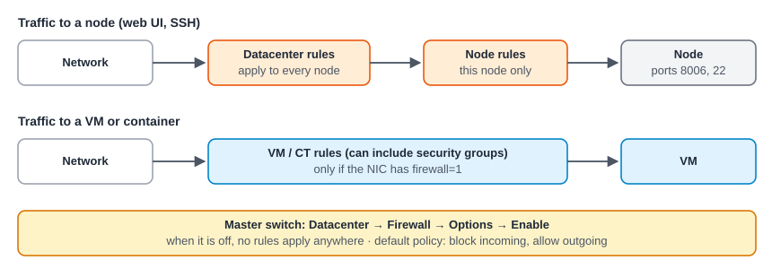

:::note[In a nutshell]
Proxmox has a built-in firewall with rules at three levels: **datacenter**, **node** and **VM**. Nothing is filtered until the datacenter master switch is turned on, and a careless rule can lock you out of every node.
:::



## Building blocks

| Thing | What it is |
|---|---|
| **Rule** | Direction (in/out), action (accept/drop/reject), and source, destination, port or *macro* (e.g. `SSH`, `HTTPS`). Rules are checked top to bottom, and the first match wins. |
| **Security group** | A named set of rules defined once (e.g. `webserver`) and reused on many VMs |
| **IPSet** | A named list of IPs or networks to use in rules |
| **Alias** | A name for one IP or network |
| **Default policy** | What happens when no rule matches: by default, incoming is dropped and outgoing is allowed |

## Turning it on safely

1. **Check management access first.** Proxmox automatically allows the web UI (8006) and SSH from the cluster's own network. Add any other admin networks before enabling.
2. **Datacenter → Firewall → Options → Enable.**
3. **For each VM:** enable it under **VM → Firewall → Options**, and tick **Firewall** on the VM's network card.

:::caution
Turning on the datacenter firewall without allowing your own network can **lock you out of every node**. Keep console access (IPMI / iDRAC) handy the first time.
:::

## Locked out by the firewall

```bash
# From the node's IPMI / iDRAC console:
pve-firewall stop      # this node stops filtering (temporary)
# Fix the rule in the web UI (Datacenter → Firewall), or in /etc/pve/firewall/cluster.fw
pve-firewall start
```

## Useful VM options

- **IP filter**: stops a VM from using IP addresses it wasn't given (anti-spoofing).
- **MAC filter**: on by default. Stops a VM from faking its MAC address.
- **Log level**: logs dropped packets per VM for troubleshooting.

## Where rules are stored

| Level | File | API |
|---|---|---|
| Datacenter | `/etc/pve/firewall/cluster.fw` | `/cluster/firewall/rules` |
| Node | `/etc/pve/nodes/<node>/host.fw` | `/nodes/{node}/firewall/rules` |
| VM / CT | `/etc/pve/firewall/<vmid>.fw` | `/nodes/{node}/qemu/{vmid}/firewall/rules` (or `lxc`) |
| Security groups | in `cluster.fw` | `/cluster/firewall/groups` |

## Quick reference

| Task | Web UI | CLI |
|---|---|---|
| Firewall status | Datacenter → Firewall | `pve-firewall status` |
| See the generated rules | n/a | `pve-firewall compile` |
| Firewall log | Node / VM → Firewall → Log | `/var/log/pve-firewall.log` |

## Gotchas

- **VM rules do nothing** unless the VM firewall is enabled *and* the NIC has `firewall=1`.
- **Rule order matters.** A broad rule near the top can hide the ones below it.
- A newer **nftables**-based firewall (`proxmox-firewall`) exists as an opt-in technology preview. It isn't meant for production yet, and the default is still the classic one.
