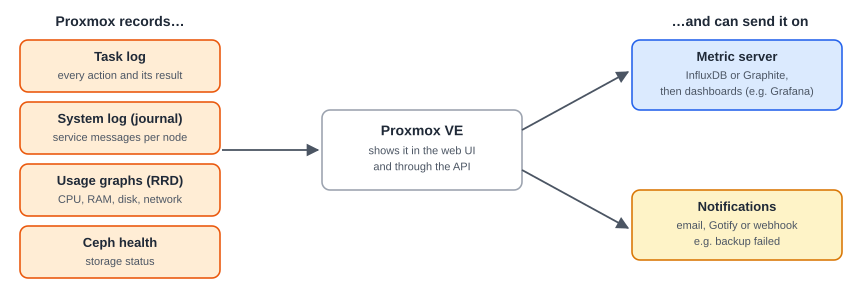

:::note[In a nutshell]
when something goes wrong, check the **task log** first (what happened), then the **system log** (why). For trends and alerts, send metrics and notifications to external tools, so problems are found before users find them.
:::

## Task log: "what happened?"

- Every action (start, clone, backup, migrate…) is a task with a status: `OK`, `WARNINGS: n` or an error message.
- **Where:** the bottom panel of the web UI, or **Node / VM → Task History**. Double-click a task for its full log.
- The log nearly always contains the real error text behind a failed API call.

## System log: "why did it happen?"

- **Node → System → System Log**, or `journalctl` on the node.
- Useful services: `pveproxy` (API), `pvedaemon` (actions), `pve-cluster` and `corosync` (cluster), `pve-ha-crm` / `pve-ha-lrm` (HA). Where everything lives: [4.6 Configuration & Log Files](../../reference/config-log-files/).

## Usage and status

- **Summary** tabs show CPU, memory, disk and network graphs for nodes, VMs and storage.
- `GET /cluster/resources` returns the status and usage of **every** node, VM, container and storage in one call. It's the best single call for dashboards and custom apps.

## What to watch

| Signal | Alert when | Why |
|---|---|---|
| Node online | Any node offline | Its VMs are down, or HA is failing over |
| Quorum | Not quorate | No changes possible |
| Ceph health | Not `HEALTH_OK` for more than a few minutes | Slow or blocked storage |
| Storage usage | Above 80% | Thin pools and Ceph freeze VMs when full |
| Backups | Any failed job | A gap in the safety net |
| HA resources | Any in `error` | The VM won't be recovered automatically |
| Certificates | Less than 14 days to expiry | The web UI and API become unreachable for clients |
| Disk SMART | Any disk not `PASSED` | Replace it before it fails |

## Setting it up

| What | Where | Options |
|---|---|---|
| **Notifications** | Datacenter → Notifications | Add *targets* (email via sendmail or SMTP, Gotify, webhook), then *matchers* that decide which events go where |
| **Metrics** | Datacenter → Metric Server | InfluxDB or Graphite, then dashboards (e.g. Grafana) |
| **Backup Server** | Its own web UI | It has its own notification settings, so set those up too |

## Quick reference

| Task | Web UI | CLI | API |
|---|---|---|---|
| Recent tasks, cluster-wide | Bottom panel → Tasks | n/a | `GET /cluster/tasks` |
| Failed tasks on a node | Node → Task History | `pvenode task list --errors 1` | `GET /nodes/{node}/tasks?errors=1` |
| One task's log | Double-click the task | `pvenode task log <UPID>` | `GET /nodes/{node}/tasks/{upid}/log` |
| System log | Node → System → System Log | `journalctl -u pvedaemon -u pveproxy` | `GET /nodes/{node}/journal` |
| Status of everything | Datacenter → Summary | `pvesh get /cluster/resources` | `GET /cluster/resources` |
| Usage history | Summary graphs | n/a | `GET …/rrddata?timeframe=hour` |
