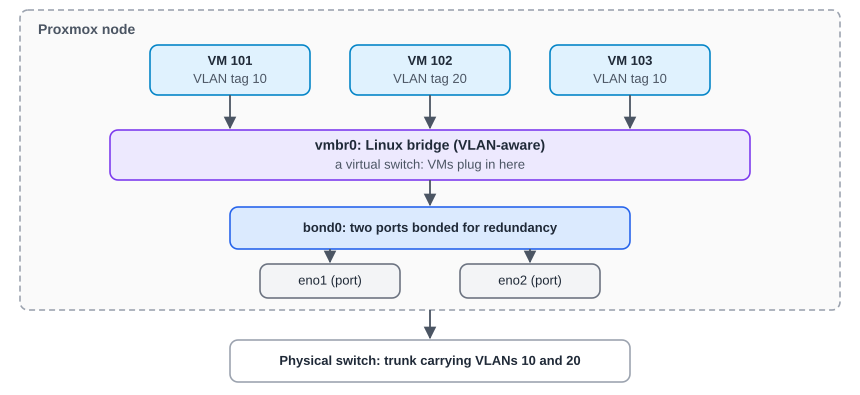

:::note[In a nutshell]
VMs plug into a virtual switch on each node called a **bridge**. VLAN tags keep networks apart on one bridge. **SDN** defines networks once for the whole cluster. Keep console access (IPMI / iDRAC) before changing node networking.
:::

## Inside a node

| Piece | What it does |
|---|---|
| **Port** (`eno1`) | A physical network card |
| **Bond** (`bond0`) | Two or more ports acting as one, for redundancy or speed (active-backup or LACP) |
| **Bridge** (`vmbr0`) | A virtual switch that VMs connect to. *VLAN-aware* means each VM NIC can have its own tag. |
| **VLAN tag** | Set on the VM's NIC. It puts that VM on that VLAN. |

Node networking lives in `/etc/network/interfaces`. Edit it under **Node → System → Network**, then click **Apply Configuration**.

## SDN: networks for the whole cluster

SDN builds on bridges, so the same network exists on every node.

| Zone type | Use it for |
|---|---|
| **Simple** | An isolated network on each node, optionally with NAT and DHCP |
| **VLAN** | Ordinary VLANs on an existing bridge |
| **QinQ** | VLANs inside VLANs (stacked tags) |
| **VXLAN** | Layer-2 networks tunnelled between nodes over IP |
| **EVPN** | VXLAN plus BGP routing: large, routed, multi-tenant setups |

- **IPAM** tracks IP addresses: Proxmox's built-in IPAM, **NetBox** or **phpIPAM**.
- **Fabrics** (new in PVE 9) set up the routed network *between* nodes. PVE 9.2 adds WireGuard and BGP fabrics.

:::caution
SDN changes do nothing until you **Apply** them (**Datacenter → SDN → Apply**, `pvesh set /cluster/sdn`, or `PUT /cluster/sdn`).
:::

## VM network card settings

| Setting | Notes |
|---|---|
| **Bridge / VNet** | Which network to plug into |
| **VLAN tag** | Only on VLAN-aware bridges. Leave empty with SDN VNets, because the zone handles tagging. |
| **Model** | VirtIO |
| **Firewall** | Must be ticked for VM firewall rules to apply (see [3.7 Firewall](../firewall/)) |
| **Rate limit** | Caps the bandwidth in MB/s |

## VM has no network: check in this order

1. **Console:** is the OS up, and does it have an IP?
2. **NIC settings:** the right bridge/VNet and VLAN tag?
3. **SDN:** any pending changes not yet applied?
4. **Firewall:** VM firewall on, with rules blocking the traffic? Check VM → Firewall → Log.
5. **Physical side:** is the VLAN allowed on the switch trunk to that node?

## Quick reference

| Task | Web UI | CLI | API |
|---|---|---|---|
| Node interfaces | Node → System → Network | `ip -br a` | `GET /nodes/{node}/network` |
| Apply node network changes | Network → Apply Configuration | `ifreload -a` | `PUT /nodes/{node}/network` |
| List / create VNets | Datacenter → SDN → VNets | `pvesh get /cluster/sdn/vnets` | `GET\|POST /cluster/sdn/vnets` |
| Apply SDN | Datacenter → SDN → Apply | `pvesh set /cluster/sdn` | `PUT /cluster/sdn` |
| Set a VM NIC | Hardware → Network Device | `qm set 101 --net0 virtio,bridge=vmbr0,tag=10` | `PUT …/qemu/{vmid}/config` (`net0=…`) |

## Gotchas

- **A bad network change can cut a node off.** Have IPMI / iDRAC access before editing node networking.
- **Permissions:** connecting a VM to a bridge or VNet needs `SDN.Use` on `/sdn/zones/<zone>/<vnet>`. Plain bridges count too, under the zone `localnetwork`.
- Upgrading to PVE 9 can **rename network interfaces**. Pin them first (see [4.9 Upgrading from PVE 8 to 9](../../reference/upgrading-8-to-9/)).
