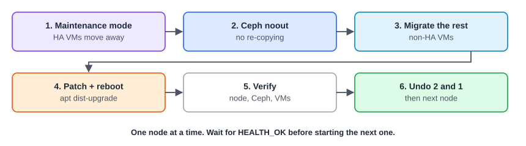

:::note[In a nutshell]
empty the node, patch it, reboot it, check it, put it back. One node at a time.
:::



```bash
# 1. Move HA-managed VMs off the node
ha-manager crm-command node-maintenance enable node2

# 2. Ceph clusters: stop Ceph re-copying data while the node is briefly away
ceph osd set noout

# 3. Move the remaining VMs (or use Node → Bulk Migrate)
qm migrate 105 node1 --online

# 4. Patch and reboot
apt update && apt dist-upgrade
reboot

# 5. Verify once it's back
pvecm status          # node back, cluster quorate
ceph -s               # all OSDs up, HEALTH_OK (apart from the noout flag)

# 6. Undo, then move on to the next node
ceph osd unset noout
ha-manager crm-command node-maintenance disable node2
```

:::caution
**One node at a time.** Rebooting a second node before Ceph is back to `HEALTH_OK` can make data unavailable.
:::

## Updates and repositories

- **Enterprise repository** (subscription): better-tested updates, recommended for production. **No-subscription**: the same features, with less testing.
- Check repositories in **Node → Updates → Repositories**. Keep every node on the same repository and version.
- Use `apt dist-upgrade`, never `apt upgrade`. A new `proxmox-kernel-*` package means a reboot is needed.

## Cluster-wide network or corosync work (PVE 9.2+)

Work that might briefly break cluster communication can make nodes fence themselves. **Disarm HA** first, and re-arm it straight after:

```bash
ha-manager crm-command disarm-ha freeze    # HA keeps everything as it is, and won't react
# ... do the work ...
ha-manager crm-command arm-ha
```

While HA is disarmed, failures are **not** recovered. Keep the window short.
