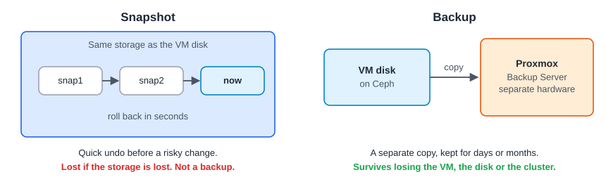

:::note[In a nutshell]
a **snapshot** is a quick undo point that lives next to the disk. A **backup** is a separate copy on Proxmox Backup Server. You need both, for different jobs. Check backups every day, and test restores regularly.
:::

## Snapshots

- Take one **before a risky change** (an upgrade, a config change), and delete it once you're happy.
- Tick **Include RAM** to save the running state too. Rolling back then resumes exactly where you were.
- Needs storage that supports snapshots (Ceph RBD, ZFS, LVM-thin or qcow2).
- **Don't keep them for long.** Long snapshot chains slow the disk down and use up space.

## Backups

| Mode | VM downtime | Notes |
|---|---|---|
| **Snapshot** (default) | None | The VM keeps running. Use the guest agent for a clean, consistent copy. |
| **Suspend** | Short pause | Rarely needed |
| **Stop** | Yes, during the backup | Most consistent |

Backups to PBS are **incremental**: after the first one, only changed blocks are read while the VM keeps running. A VM restart makes the next backup re-read the whole disk, but it is still stored deduplicated.

### Backup jobs and retention

Schedule jobs in **Datacenter → Backup**: which VMs, when, to which storage, and how many to keep.

| Keep option | Example |
|---|---|
| `keep-last` | The last 3 backups, whatever their age |
| `keep-daily` / `keep-weekly` / `keep-monthly` / `keep-yearly` | 7 daily + 4 weekly + 6 monthly |

## Restoring

| Need | How |
|---|---|
| The whole VM back | VM → Backup → pick one → **Restore**. Use a **new VMID** unless you really mean to replace the VM. |
| The VM running again fast | Restore with **Live restore** (PBS only). The VM starts while data streams in the background. |
| A few files only | VM → Backup → pick one → **File Restore** (PBS only) |
| From the shell | `qmrestore <backup> 101` (VM), `pct restore 200 <backup>` (CT) |

:::caution
Restoring **over an existing VM replaces its disks**. If in doubt, restore to a new VMID and compare.
:::

## Backup Server housekeeping

- **Datastore usage** below 80%.
- **Prune** removes old backups, and **garbage collection** frees the space. Both must run.
- **Verify** jobs check that backups are readable. Investigate any failure.
- **Test a restore** regularly. A backup you've never restored is a guess.

## Quick reference

| Task | Web UI | CLI | API |
|---|---|---|---|
| Take a snapshot | VM → Snapshots → Take Snapshot | `qm snapshot 101 pre-upgrade` | `POST …/qemu/{vmid}/snapshot` |
| Roll back | Snapshots → Rollback | `qm rollback 101 pre-upgrade` | `POST …/snapshot/{name}/rollback` |
| Delete a snapshot | Snapshots → Remove | `qm delsnapshot 101 pre-upgrade` | `DELETE …/snapshot/{name}` |
| Back up now | VM → Backup → Backup now | `vzdump 101 --storage pbs --mode snapshot` | `POST /nodes/{node}/vzdump` |
| List backups on a storage | Storage → Backups | `pvesm list pbs --content backup` | `GET /nodes/{node}/storage/{storage}/content?content=backup` |
| Backup jobs | Datacenter → Backup | `pvesh get /cluster/backup` | `GET /cluster/backup` |
| Recent backup results | Task log (filter *Backup*) | `pvenode task list --typefilter vzdump` | `GET /nodes/{node}/tasks?typefilter=vzdump` |
| Restore a VM | Backup → Restore | `qmrestore pbs:backup/vm/101/… 101` | `POST /nodes/{node}/qemu` with `archive=…` |

## Gotchas

- **A snapshot is not a backup.** If the storage dies, its snapshots die with it.
- While a backup runs, the VM is **locked**: no migration, snapshot or config change until it finishes.
