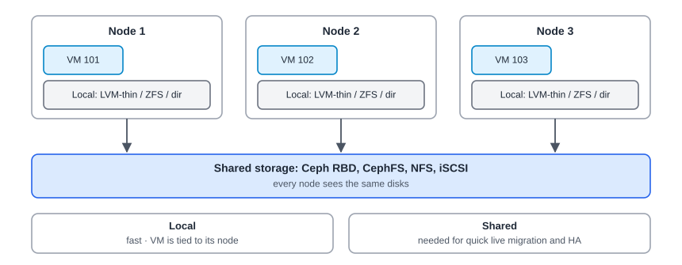

:::note[In a nutshell]
a **storage** is any place Proxmox can keep disks, ISOs, templates or backups. **Local** storage is fast but ties a VM to one node. **Shared** storage lets VMs move between nodes and restart elsewhere. Keep every storage below about **80%** full.
:::

## Storage types

| Type | Shared? | Snapshots | Typical use |
|---|---|---|---|
| **Ceph RBD** | Yes | Yes | VM and container disks (see [3.5 Ceph](../ceph/)) |
| **CephFS** | Yes | n/a | ISOs, templates, snippets shared by all nodes |
| **NFS / SMB** | Yes | With qcow2 | ISOs, backups, simple shared disks |
| **LVM (thick)** on iSCSI / FC | Yes | PVE 9: technology preview | SAN storage |
| **LVM-thin** | No | Yes | Fast local disks |
| **ZFS** | No | Yes | Local disks with checksums, plus replication between nodes |
| **Directory** | No | With qcow2 | The `local` storage: ISOs, templates, small backups |
| **Proxmox Backup Server** | Yes | n/a | Backups only |

:::note
**Version 9:** GlusterFS support was removed. Any GlusterFS storage must be moved before upgrading.
:::

## What a storage can hold

Each storage is set up to allow certain **content types**:

| Content | API name | Holds |
|---|---|---|
| Disk image | `images` | VM disks |
| Container | `rootdir` | Container disks |
| ISO image | `iso` | Installer ISOs |
| Container template | `vztmpl` | Container templates |
| Backup | `backup` | vzdump backups |
| Snippets | `snippets` | Cloud-init files and hook scripts |

## How disks are named

Every disk is referenced as `<storage>:<volume>`, for example `ceph-pool:vm-101-disk-0`. This is the format you see in VM configs, CLI output and API responses.

## Capacity

- **Thin storage** (LVM-thin, ZFS, Ceph) only uses space as disks fill, so it's easy to promise more than exists. Check what's **actually** used.
- **Free space quickly** by removing old snapshots, old backups, and *Unused Disk* entries on VMs (Hardware tab).
- The `local` storage sits on the node's system disk. Keep big backups and ISOs off it.

## Quick reference

| Task | Web UI | CLI | API |
|---|---|---|---|
| Storages and usage | Datacenter → Summary | `pvesm status` | `GET /nodes/{node}/storage` |
| What's on a storage | Storage → content tabs | `pvesm list ceph-pool` | `GET /nodes/{node}/storage/{storage}/content` |
| Storage definitions | Datacenter → Storage | `cat /etc/pve/storage.cfg` | `GET /storage` |
| Move a VM disk (works while running) | Hardware → Disk Action → Move Storage | `qm disk move 101 scsi0 ceph-pool` | `POST /nodes/{node}/qemu/{vmid}/move_disk` |
| Real usage of thin storage | n/a | `lvs` (LVM-thin), `zpool list` (ZFS), `ceph df` | n/a |
| Disk SMART health | Node → Disks | `smartctl -a /dev/sdX` | `GET /nodes/{node}/disks/smart?disk=/dev/sdX` |

## Gotchas

- **A full thin pool freezes VMs.** Alert well before it fills up (see [3.11 Monitoring & Alerting](../monitoring-alerting/)).
- **A VM on local storage can't use HA**, and live migration has to copy the whole disk.
