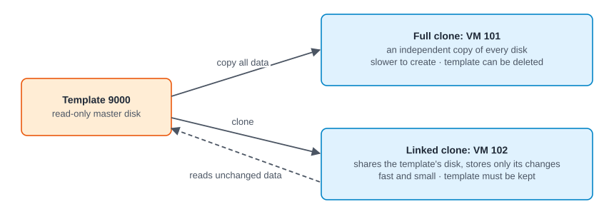
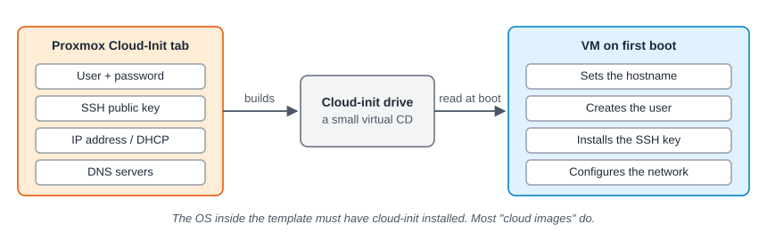

:::note[In a nutshell]
a **template** is a ready-made master VM you clone from. **Cloud-init** gives each clone its own user, SSH key and IP address on first boot, so nobody has to log in and set it up.
:::

## Templates and clones



- Converting a VM to a template is **one-way**, and a template can't be started.
- Cloning a template makes a **linked clone by default** (on storage that supports it, such as Ceph). Pass `full=1` for a full copy.
- To update a template: clone it, change the clone, then turn the clone into a **new** template (e.g. `ubuntu-24.04-v2`). Don't delete the old template while linked clones still use it.

## Cloud-init



| Setting | API parameter | Example |
|---|---|---|
| User | `ciuser` | `ubuntu` |
| Password | `cipassword` | Prefer SSH keys |
| SSH keys | `sshkeys` | Public key(s), **URL-encoded** |
| IP address | `ipconfig0` | `ip=dhcp` or `ip=10.0.0.5/24,gw=10.0.0.1` |
| DNS | `nameserver`, `searchdomain` | `10.0.0.53` |
| Custom user-data | `cicustom` | `user=local:snippets/web.yaml` (needs a storage with *Snippets* content) |

## Build a cloud-init template

```bash
# 1. Empty VM
qm create 9000 --name ubuntu-24.04 --memory 2048 --cores 2 \
  --net0 virtio,bridge=vmbr0 --scsihw virtio-scsi-single --agent enabled=1
# 2. Import a cloud image as the boot disk
qm set 9000 --scsi0 ceph-pool:0,import-from=/root/noble-server-cloudimg-amd64.img,discard=on
# 3. Add the cloud-init drive, boot order and a serial console (cloud images expect one)
qm set 9000 --ide2 ceph-pool:cloudinit --boot order=scsi0 --serial0 socket --vga serial0
# 4. Turn it into a template
qm template 9000
```

Then clone it and set the cloud-init values on each clone (see [2.5 Your First API Calls](../../getting-started/first-api-calls/)).

## Gotchas

- **`sshkeys` must be URL-encoded** in API calls. Unencoded keys are the most common cloud-init mistake.
- Cloud-init mostly runs on **first boot**. Changing settings later may not change an already configured VM.
- No IP address showing? Install the **QEMU guest agent** in the template. On PVE 9, reading it needs the `VM.GuestAgent.Audit` privilege.
- The image must have cloud-init installed. Official "cloud images" do; ISO installs usually don't.
