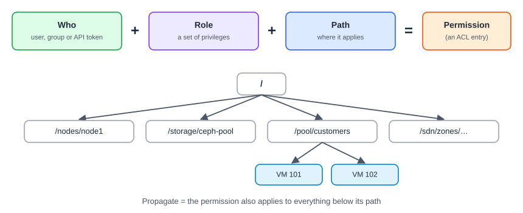

:::note[In a nutshell]
a permission is **who** + **role** + **path**. Give each person or custom app only the roles it needs, on only the paths it needs. Grant to groups, not individuals, and keep `root@pam` for emergencies.
:::

## Who: users, groups and tokens

| Realm | Logins checked against |
|---|---|
| `pam` | Linux users on the node (e.g. `root@pam`) |
| `pve` | Proxmox's own user database |
| LDAP / AD / OpenID | A company directory or SSO |

- Grant permissions to **groups**, not individual users. It's easier to manage.
- An **API token** belongs to a user: `appuser@pve!provisioner`. With **privilege separation** on (recommended), the token gets only the permissions given to the token itself, and never more than its user has.

## Role: what they can do

| Built-in role | Can |
|---|---|
| `Administrator` | Everything |
| `PVEAdmin` | Almost everything, except changing system settings and permissions |
| `PVEVMAdmin` | Fully manage VMs |
| `PVEVMUser` | Use VMs: power, console, backup, but not change hardware |
| `PVEDatastoreUser` | Allocate space and use backups on a storage |
| `PVEAuditor` | Read-only, everywhere: good for monitoring and first-line support |
| `NoAccess` | Blocks access below a path |

For a custom app, a **custom role** holding exactly the privileges it needs is better than a broad built-in one.

## Path: where it applies

| Path | Covers |
|---|---|
| `/` | Everything |
| `/vms/{vmid}` | One VM or container |
| `/pool/{pool}` | Every VM and storage in a pool, which is great for "everything the custom app manages" |
| `/storage/{storage}` | One storage |
| `/sdn/zones/{zone}/{vnet}` | One network |
| `/nodes/{node}` | One node |

## Example: what a custom app needs to clone and start VMs

| Privilege | On path |
|---|---|
| `VM.Clone`, `VM.Audit` | The template (`/vms/9000`) |
| `VM.Allocate`, `VM.Config.*`, `VM.PowerMgmt`, `VM.Console` | Where new VMs go (e.g. `/pool/customers`) |
| `Datastore.AllocateSpace`, `Datastore.Audit` | The target storage |
| `SDN.Use` | The VNet or bridge |
| `VM.GuestAgent.Audit` (PVE 9) | To read IP addresses from the guest agent |

:::note
**Version 9:** `VM.Monitor` was removed. Guest agent access moved to `VM.GuestAgent.*`, and monitor access to `Sys.Audit` / `Sys.Modify`. Custom roles built on PVE 8 may need updating.
:::

## Fixing "403 Permission check failed"

The error tells you what's missing, e.g. `Permission check failed (/vms/101, VM.PowerMgmt)`. Add that privilege on that path, or on a parent path with **Propagate** ticked. The full list is in [4.3 Permission Matrix](../../reference/permission-matrix/).

## Quick reference

| Task | Web UI | CLI | API |
|---|---|---|---|
| Add a user | Datacenter → Permissions → Users → Add | `pveum user add jane@pve` | `POST /access/users` |
| Reset a password (`pve` realm) | Users → Password | `pveum passwd jane@pve` | `PUT /access/password` |
| Add to a group | Users → Edit → Group | `pveum user modify jane@pve --groups support` | `PUT /access/users/{userid}` |
| Unlock 2FA after failed attempts | Users → Unlock TFA | `pveum user tfa unlock jane@pve` | `PUT /access/users/{userid}/unlock-tfa` |
| Remove a lost 2FA device | Datacenter → Permissions → Two Factor | `pveum user tfa delete jane@pve` | `DELETE /access/tfa/{userid}/{id}` |
| Disable a leaver | Users → Edit → untick Enabled | `pveum user modify jane@pve --enable 0` | `PUT /access/users/{userid}` |
| Create an API token | Permissions → API Tokens → Add | `pveum user token add appuser@pve provisioner --privsep 1` | `POST /access/users/{userid}/token/{tokenid}` |
| Create a custom role | Permissions → Roles → Create | `pveum role add AppProvisioner --privs "VM.Clone,VM.Allocate,…"` | `POST /access/roles` |
| Grant a permission | Datacenter → Permissions → Add | `pveum acl modify /pool/customers --roles AppProvisioner --tokens 'appuser@pve!provisioner'` | `PUT /access/acl` |
| See what someone can do | Users → Permissions | `pveum user permissions jane@pve` | `GET /access/permissions?userid=…` |

## Gotchas

- A token secret is shown **only once**, when it's created. Store it safely right away.
- **API tokens** belong to applications. Check which app uses a token before you change or delete it.
- **Directory users** (LDAP / AD / OpenID): reset their passwords in the directory, not in Proxmox.
- Forgetting **Propagate** means a permission covers the path itself but nothing below it.
- Don't run a custom app as `root@pam`.
