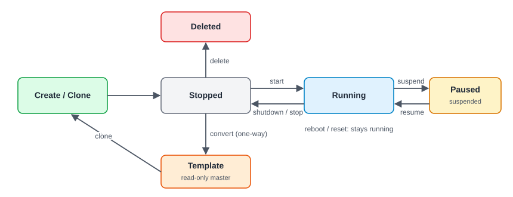

:::note[In a nutshell]
a VM moves between a few simple states: **stopped**, **running** and **paused**. Every change is a button in the web UI, a `qm` command, or an API call that starts a task. Take a **snapshot** before anything risky.
:::

## Quick reference

`…` = `/nodes/{node}/qemu/{vmid}`. For containers, use `pct` and `/lxc/` with the same sub-commands.

| Task | Web UI | CLI | API |
|---|---|---|---|
| Find a VM | Search box in the header | `pvesh get /cluster/resources --type vm` | `GET /cluster/resources?type=vm` |
| Create | Create VM (header) | `qm create 101 …` | `POST /nodes/{node}/qemu` |
| Clone | Right-click → Clone | `qm clone 9000 101 --name web01` | `POST …/clone` |
| Start / shut down / reboot | VM toolbar | `qm start\|shutdown\|reboot 101` | `POST …/status/start\|shutdown\|reboot` |
| Force off (hung VM) | Shutdown ▾ → Stop | `qm stop 101` | `POST …/status/stop` |
| Suspend / resume | Shutdown ▾ → Pause | `qm suspend\|resume 101` | `POST …/status/suspend\|resume` |
| Current status | VM → Summary | `qm status 101` | `GET …/status/current` |
| Console | VM → Console | `qm terminal 101` (serial only) | `POST …/vncproxy` |
| Change CPU / RAM | Hardware → Edit | `qm set 101 --cores 4 --memory 8192` | `PUT …/config` |
| See pending changes | Hardware (shown in orange) | `qm pending 101` | `GET …/pending` |
| Grow a disk | Hardware → Disk Action → Resize | `qm disk resize 101 scsi0 +10G` | `PUT …/resize` |
| Add a disk / NIC | Hardware → Add | `qm set 101 --scsi1 ceph-pool:32` / `--net1 virtio,bridge=vmbr0,tag=20` | `PUT …/config` |
| Attach an ISO | Hardware → CD/DVD Drive → Edit | `qm set 101 --ide2 local:iso/file.iso,media=cdrom` | `PUT …/config` |
| Snapshot / roll back | VM → Snapshots | `qm snapshot 101 before-change` / `qm rollback 101 before-change` | `POST …/snapshot` / `…/snapshot/{name}/rollback` |
| IP addresses | VM → Summary (needs the guest agent) | `qm guest cmd 101 network-get-interfaces` | `GET …/agent/network-get-interfaces` |
| Delete | More → Remove | `qm destroy 101 --purge` | `DELETE …?purge=1&destroy-unreferenced-disks=1` |

## Shutdown, stop, reboot, reset

| Action | What happens | Use when |
|---|---|---|
| **Shutdown** | Asks the OS to power off cleanly (through the guest agent or ACPI) | Normally |
| **Stop** | Pulls the plug immediately | The VM is hung, or a shutdown timed out |
| **Reboot** | A clean shutdown followed by a start. It also applies pending changes. | After changing hardware settings |
| **Reset** | Presses the reset button. No clean shutdown. | Last resort |

## Settings that matter

| Setting | Recommended | Why |
|---|---|---|
| **CPU type** | `x86-64-v2-AES` (the default), or a shared model across the cluster | `host` is fastest, but can block live migration between different CPUs |
| **Memory** | Fixed size, with ballooning on | Lets the host take back unused RAM |
| **Disk bus** | SCSI with the *VirtIO SCSI single* controller, plus `discard` and `iothread` | Fast, and returns freed space to thin storage |
| **Network** | VirtIO model | Fastest virtual NIC |
| **QEMU Guest Agent** | Enabled, and installed inside the VM | Clean shutdowns, IP addresses visible, consistent backups |

## Changing a running VM

- Most changes to **disks and NICs** apply straight away (hotplug).
- Changes to **CPU and memory** usually become **pending**, shown in orange in the Hardware tab. They apply on the next **Proxmox** reboot, or a stop and start. A reboot from inside the guest OS doesn't apply them.
- **Disks can only grow**, never shrink. After growing a disk, extend the partition inside the OS (cloud-init images often do this automatically).

## Stuck or locked VMs

A VM shows a **lock** (a padlock icon, or `VM 101 is locked (backup)`) while a task is working on it. Most locks clear themselves when the task ends.

1. **Look for a running task** on the VM: the task log, or `pvenode task list --vmid 101 --source active`.
2. **Task running?** Wait, or stop that task from the task log if it's clearly stuck.
3. **No task** (e.g. after a node crash)? Check the lock (`qm config 101 | grep lock`) and clear it with `qm unlock 101`.
4. **Still won't stop?** `qm stop 101 --skiplock` (root only).

:::caution
Never unlock a VM while its backup, migration or clone is still running. Doing so can corrupt the VM or its disks.
:::

## Gotchas

- **Shutdown times out:** the guest agent isn't installed, or the OS ignores ACPI. Fall back to `stop`.
- **Delete without `purge`** leaves the VM in backup jobs and HA. Always purge.
- **For custom apps:** every power action returns a task ID. Wait for it before the next step (see [4.2 Async Tasks & UPIDs](../../reference/tasks-upids/)), and send only one change at a time per VM.
